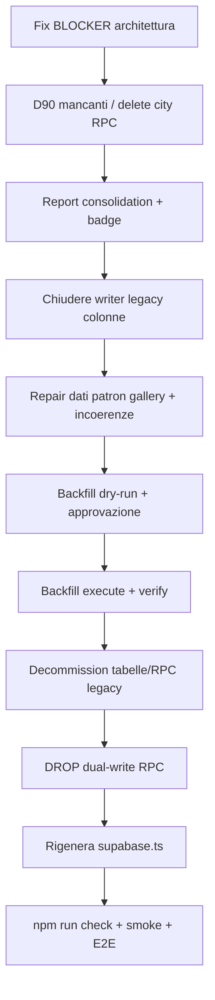

# Image Management — Analisi approfondita consolidamento / legacy decommissioning

> **Source of Truth documentale (BIBBIA operativa):** **`AI_IMAGE_MANAGEMENT_CONSOLIDATION_DEEP_ANALYSIS_2026-09-27_v5.md`** (questo file) + `AI_IMAGE_MANAGEMENT_CONSOLIDATION_EXECUTION_ANALYSIS_2026-09-27.md` **§37–§44** + `AI_IMAGE_MANAGEMENT_MASTER_PLAN.md` Appendici I–O.  
> **Tipo:** analisi tecnica read-only (solo repository; nessuna modifica codice/DB/backfill in questa sessione).  
> **Data ultimo aggiornamento:** 2026-09-28 (§44 — D-CONS-36 `submit_community_poi` verifica Supabase chiusa)  
> **Fase decisionale:** **CHIUSA** D-CONS-01…36. **Fase tecnica:** §41–§43 pronti; implementazione WM + decom legacy **non** avviata.  
> **Continuità documentale:** segue `AI_IMAGE_MANAGEMENT_POST_MF5_GLOBAL_AUDIT.md`, `AI_IMAGE_MANAGEMENT_MASTER_PLAN.md`, `AI_IMAGE_MANAGEMENT_FINAL_CLOSURE_PLAN.md`.  
> **Legenda stati:** 🔴 BLOCKER · 🟡 QUALITY / ARCHITECTURAL DELTA · 🟢 VERIFIED OK · ⚪ OUT OF CURRENT SCOPE · ❓ NOT VERIFIED  
> **Origine finding:** **[CHECKLIST]** = punto del prompt di partenza · **[DISCOVERY]** = emerso in questa analisi · **[CORRECTION]** = checklist/audit precedente da rettificare

## REGOLA FONDAMENTALE — MODIFICHE CHE POSSONO ROMPERE QUALCOSA

Identica a `AI_IMAGE_MANAGEMENT_CONSOLIDATION_EXECUTION_ANALYSIS_2026-09-26.md` (testa documento). Nessuna implementazione senza conferma proprietario; registrare **BLOCCO / DECISIONE DA CONFERMARE** con: cosa si rompe, perché, percorso UI, file/RPC/DB, soluzione proposta, cosa decidere, cosa non toccare ancora.

---

## 1. Executive Summary

Il repository contiene **infrastruttura MF1–MF5 matura** (schema `media_assets`, `entity_image_assignments`, `entity_image_history`, `content_reports`, RPC report/D90/backfill/patron gallery/POI merge) e un **cutover read fail-closed** per Person/POI primary via `entityPrimaryImageReadService.ts`.

**Gap strutturali confermati:**

| Area | Verdetto | Nota |
|------|----------|------|
| Dati vs read SoT | 🔴 | Cutover read **senza fallback legacy** → entità senza assignment appaiono senza immagine fino a backfill (coerente con audit POST-MF5 ~256 would-create; **❓ conteggio runtime non rieseguito**). |
| Report Famous/Patron legacy | 🟡 | UI abuso foto → **MF2 `content_reports`**; servizi `*PhotoReportService.ts` **senza caller UI** salvo **badge count** legacy. |
| `deleteCity()` | 🔴 | Cascata client **non atomica**; non usa D90 delete; rischio **FK/history RESTRICT** su delete città con assignment storici. |
| POI merge + `verified_real` | 🟢 (III–IV) | **INT-02 rimosso.** **INT-03 rimosso (IV):** merge nominale senza foto; bypass Media→merge possibile ma atipico (execution §28.1). |
| Patron primary write | 🟡 | PATCH città + RPC assignment **non atomici**; JSON `patron_details.imageUrl` ancora persistito. |
| Dual-write RPC | 🟡 | `upsert_entity_image_assignment_dual_write` — **3 caller runtime** (+ repair/backfill indiretti); nome storico, SQL **non** aggiorna colonne legacy entità. |
| Tipi Supabase | 🟡 | Molte RPC POST-MF5 assenti da `src/types/supabase.ts`; boundary `mf2DbClient` / `mf4DbClient` / `mf3DbClient` ancora necessari. |

**Verdetto complessivo:** **NOT READY FOR LEGACY DECOMMISSION** — architettura target presente, ma cutover operativo, report consolidation, delete città, merge POI e badge admin richiedono lavoro prima di backfill execute e rimozione legacy.

---

## 2. Architecture Current State

### 2.1 Modello target (Master Plan §42) — 🟢 VERIFIED OK nel repo

- **`media_assets`:** oggetto autonomo (`20260916120200_media_assets_schema.sql` + enum/status MF3).
- **`entity_image_assignments`:** relazione governabile (`20260916130000_entity_image_assignments.sql`).
  - `media_asset_id` → `media_assets` **ON DELETE RESTRICT**
  - `city_id` → `cities` **ON DELETE CASCADE**
  - `entity_id` polimorfico (uuid-as-text / text territoriale)
  - Unique partial: un solo `primary` + `is_current` per `(entity_type, entity_id, city_id)`
- **`entity_image_history`:** append-only, FK assignment/media **ON DELETE RESTRICT** (`20260920120000_entity_image_history.sql`).
- **`content_reports`:** report unificato MF2 (`20260916130100_content_reports.sql`); RPC `20260916130200_report_rpcs.sql` + evidence `20260916130300`.
- **Principi:** riuso asset via più assignment; rimozione assignment ≠ delete asset; snapshot opzionali su assignment/report.

### 2.2 Read SoT POST-MF5 — 🟢 VERIFIED OK (Person/POI primary)

`src/services/media/entityPrimaryImageReadService.ts`:

- Query `entity_image_assignments`: `primary`, `is_current`, chunk 200.
- URL solo se `assignment_status === 'active'` + asset `isPublicUsableImageAssetStatus`.
- Duplicati primary correnti → fail-closed (warn + immagine vuota).

**Applicazione:**

| Dominio | File | Cutover |
|---------|------|---------|
| City Person | `entitiesService.ts` (`getCityPeople*`, post-`saveCityPerson`) | 🟢 |
| POI | `poiRead.ts` (tutti i path list/detail) | 🟢 |
| Patron primary pubblico | `PatronSaintModal` → `resolvePatronPrimaryImageUrl` | 🟢 |
| Patron primary batch | `mediaService.resolvePrimaryImagePublicUrlsForCityPeople` (portrait dedup) | 🟢 person only |

### 2.3 Read ibrido / legacy residuo — 🟡

| Path | Comportamento | Stato |
|------|---------------|-------|
| `parsePatron` / `cityReadService` | Legge `patron_details.imageUrl` da JSON | 🟡 JSON legacy ancora popolato da PATCH città |
| `CulturePatronMainPhotoSection` | `resolvePatronDisplayImageUrl(patronDetails, masterUrl)` | 🟡 Admin UI non usa assignment SoT |
| `resolvePoiDisplayImageUrl` | snapshot → catalog → **placeholder categoria** | 🟢 intenzionale display layer; catalog = post-cutover URL |
| `cityReadService` hero città | `cities.image_url` | ⚪ fuori MF5 Person/POI/Patron |
| Community `photoService` | `photo_submissions.image_url` | ⚪ dominio foto community (assignment parziale) |

### 2.4 Write — tre famiglie — **[CHECKLIST] confermato**

1. **D90 RPC:** `save_city_person_with_image_assignment`, `delete_city_person_with_image_cleanup`, `save_poi_with_image_assignment`, `delete_poi_with_image_cleanup`, patron gallery RPC POST-MF5, `accept_famous_person_photo_suggestion`, `merge_pois_observatory_atomic` + reconcile.
2. **RPC transitoria assignment-only:** `upsert_entity_image_assignment_dual_write` via `entityImageAssignmentWriteService.ts`.
3. **Legacy colonne / tabelle parallele:** `famous_person_photo_reports`, `patron_photo_reports`, JSON patron, `city_patron_gallery.image_url`, `cities.image_url`, community photo column, ecc.

---

## 3. Legacy System Inventory

| Artefatto | Tipo | Runtime attivo? | Sostituto MF2/MF5 | Stato |
|-----------|------|-----------------|-------------------|-------|
| `famous_person_photo_reports` | Tabella + RLS | Insert/update **solo** se chiamato service (UI no) | `content_reports` + `ReportAbuseModal` | 🟡 decommissionabile dopo migrazione storico + badge |
| `block_famous_person_photo_report_and_clear` | RPC | **0 caller UI** (solo service dead) | `transition_report_status` (image_abuse KO) | 🟡 |
| `famousPersonPhotoReportService.ts` | Service | **Solo** `getPendingFamousPersonPhotoReportCount` | `contentReportService` | 🟡 |
| `patron_photo_reports` + `patronPhotoReportService.ts` | Tabella + service | **Solo** count badge | `content_reports` + wrapper modale | 🟡 |
| `city_people.image_url` / `image_storage_path` | Colonne | Save D90 forza `image_url: null` in payload; RPC block legacy azzera colonne | assignment primary | 🟡 colonne DB + RLS report legacy |
| `pois.image_url` | Colonna | Save D90 passa `image_url: ''` in payload RPC | assignment | 🟡 |
| `patron_details.imageUrl` (JSON) | Campo | PATCH città via `serializePatronDetails` | `upsert_patron_primary_image_assignment` | 🟡 dual persistence |
| `upsert_entity_image_assignment_dual_write` | RPC | 3 caller TS + backfill indiretto | D90 per flusso | 🟡 STEP 10 decommission |
| `deleteCity()` cascade client | Service | Sì (admin lifecycle) | RPC D90 città **assente** | 🔴 |

---

## 4. Complete Caller Map

### 4.1 `upsert_entity_image_assignment_dual_write` / `upsertEntityImageAssignmentFromSource`

| Caller | File | Dominio | Runtime |
|--------|------|---------|---------|
| Community materialize | `photoService.ts` → `materializePhotoSubmissionAssignment` | `photo_submission` primary | 🟢 attivo |
| Wikimedia pipeline | `commonsDownloadPipeline.ts` | person/poi/patron primary | 🟢 attivo |
| AI portrait register | `registerAiGeneratedPortraitAsset` | person/poi/patron | 🟢 **rimozione approvata** (INT-13 — §35.4 Execution; **non** implementato) |

**Non usa dual-write (usa RPC dedicate):** `saveCityPerson`, `saveSinglePoi`, patron gallery RPC, `cityWriteService` (`upsert_patron_primary_image_assignment`).

### 4.2 Famous Person Photo Report (legacy)

| Symbol | Callers in `src/` |
|--------|-------------------|
| `createFamousPersonPhotoReport` | **nessuno** |
| `listFamousPersonPhotoReportsForAdmin` | **nessuno** |
| `blockFamousPersonPhotoReportAndClearOfficialPhoto` | **nessuno** |
| `getPendingFamousPersonPhotoReportCount` | `famousPersonAdminCountsService.ts` → `AdminDashboard` badge |

**UI abuso foto personaggio:** `ReportFamousPersonPhotoAbuseModal.tsx` → `ReportAbuseModal` → `useReportAbuseSubmit` → `submitContentReportGroup` (**content_reports**). 🟢

### 4.3 Patron Photo Report (legacy)

| Symbol | Callers in `src/` |
|--------|-------------------|
| `createPatronPhotoReport`, `blockPatronPhotoReportAndRemovePhoto`, … | **nessuno** |
| `getPendingPatronPhotoReportCount` | `patronAdminCountsService.ts` → sidebar `patron_saint` badge |

**UI abuso galleria patrono:** `ReportPatronPhotoAbuseModal` → MF2. 🟢

### 4.4 D90 RPC (client)

| RPC | Caller |
|-----|--------|
| `save_city_person_with_image_assignment` | `entitiesService.saveCityPerson` |
| `delete_city_person_with_image_cleanup` | `entitiesService.deleteCityPerson` |
| `save_poi_with_image_assignment` | `poiWrite.saveSinglePoi` (+ hooks/admin/observatory/regional) |
| `delete_poi_with_image_cleanup` | `poiWrite.deleteSinglePoi` |
| `upsert_patron_primary_image_assignment` / `revoke_patron_primary_image_assignment` | `cityWriteService.saveCityDetails` |
| Patron gallery insert/replace/delete | `patronGalleryImageAssignmentRpc.ts` ← `cityPatronGalleryService.ts` |
| `accept_famous_person_photo_suggestion` | `famousPersonPhotoSuggestionService.acceptFamousPersonPhotoSuggestion` |
| `reconcile_poi_image_assignments_for_merge` | `poiMergeImageAssignments.ts` ← merge observatory |
| `promote_staging_poi_to_live` | `stagingService.ts` |
| `safe_archive_media_asset` | `mediaCatalogService.safeArchiveMediaAsset` ← gallery delete patron |

### 4.5 `mediaService.ts` (storage legacy utilities)

Callers significativi MF5-adjacent: upload/delete/copy usati da patron gallery, famous person photo **suggestion** create, admin culture sections, `famousPersonPhotoReportService` (dead path cleanup), AI vision, asset library usage map.  
Classificazione: **utility storage** ancora necessaria finché upload non passa tutto da pipeline asset unificata. ⚪/🟡

### 4.6 `photoService.ts`

Dominio **community live / city gallery / photo_submissions** — sovrapposto parzialmente (assignment via dual-write RPC). Non è sostituto del modello Person/POI/Patron. 🟢 separazione dominio; 🟡 consolidamento assignment community = futuro.

---

## 5. Database / FK / RLS / RPC Analysis

### 5.1 `entity_image_assignments` — **[CHECKLIST D] lettura diretta migration**

Fonte: `20260916130000_entity_image_assignments.sql`

- FK `media_asset_id` → RESTRICT (impedisce DELETE asset con assignment)
- FK `city_id` → **CASCADE** (delete città propaga delete assignment)
- RLS: anon/authenticated read solo `active` + `is_current`; admin manage via `is_td_admin`

### 5.2 `entity_image_history` — **[DISCOVERY] impatto delete città**

- `assignment_id` → `entity_image_assignments` **ON DELETE RESTRICT**
- `media_asset_id` → `media_assets` **ON DELETE RESTRICT**
- Trigger append-only (UPDATE/DELETE vietati)

**Conseguenza logica (PostgreSQL, non probe DB):** DELETE cascata su `entity_image_assignments` (da DELETE `cities`) **fallisce** se esistono righe history che referenziano quegli assignment. 🔴 **BLOCKER** per `deleteCity()` su città con storico MF4 popolato.

### 5.3 `content_reports`

- `city_id` → cities **ON DELETE CASCADE**
- `assignment_id` → assignments **ON DELETE SET NULL**

Delete città rimuove report MF2; assignment_id annullato se assignment eliminato separatamente.

### 5.4 `famous_person_photo_reports`

- `person_id` → `city_people` **ON DELETE RESTRICT** (migration `20260827140000`)
- `delete_city_person_with_image_cleanup` **blocca** delete person se esistono righe legacy report (**qualsiasi** status) 🔴 audit trail
- `deleteCity()` **pre-delete** report per `city_id` (aggira RESTRICT a livello città) ma **non** gestisce content_reports aperti su person né assignment/history

### 5.5 RPC report centralizzato — 🟢 VERIFIED OK in repo

`20260916130200_report_rpcs.sql`: `create_content_report_group`, `transition_report_status`, `get_report_admin_context`, `capture_report_evidence`.  
`transition_report_status`: su `image_abuse` + `assignment_id` aggiorna assignment (sospensione) in transazione con report.

### 5.6 Migration inventory (image-related `202609*`)

| Migration | Oggetto principale |
|-----------|-------------------|
| `161200–161303` | MF1–MF2 base: status entità, media_assets, assignments, content_reports, report RPC, evidence |
| `171200–181200–191403–201203` | dual-write RPC (evoluzione), AI verify, history, safe_archive, catalog view |
| `221259–221300` | `upsert_entity_primary_image_assignment`, `save_city_person_with_image_assignment` |
| `231530` | POI D90 save/delete |
| `241700` | delete city person D90 |
| `241710` | accept famous person photo → assignment (POST-MF5) |
| `241820` | promote staging POI — **no write** `pois.image_url` |
| `241830–241832` | revoke/upsert patron primary, service_role grants |
| `241833–241835` | reconcile POI merge + merge observatory atomic |
| `241834` | delete patron gallery photo + assignment |
| `60827140000`, `60907120000`, `60908130000` | Famous person community legacy + block RPC + moderation |

**❓ NOT VERIFIED:** quali migration risultano applicate su DB target (solo evidenze documentali precedenti).

---

## 6. D90 Atomicity Matrix

| Operazione | Meccanismo | Classificazione |
|------------|------------|-----------------|
| City Person save | `save_city_person_with_image_assignment` | 🟢 ATOMICA SERVER-SIDE |
| City Person delete | `delete_city_person_with_image_cleanup` | 🟢 ATOMICA SERVER-SIDE |
| POI save | `save_poi_with_image_assignment` | 🟢 ATOMICA SERVER-SIDE |
| POI delete | `delete_poi_with_image_cleanup` | 🟢 ATOMICA SERVER-SIDE |
| POI merge | `merge_pois_observatory_atomic` + reconcile | 🟢 ATOMICA SERVER-SIDE |
| Staging promote POI | `promote_staging_poi_to_live` (241820) | 🟢 (no legacy image_url write) |
| Famous Person photo accept | `accept_famous_person_photo_suggestion` (241710) | 🟢 ATOMICA SERVER-SIDE |
| Patron gallery insert/replace/delete | RPC dedicate (`insert_*`, `replace_*`, `delete_*`) | 🟢 ATOMICA SERVER-SIDE (DB) |
| Patron gallery upload URL | `addCityPatronGalleryPhoto`: upload client **poi** RPC | 🟡 ATOMICITÀ PARZIALE (storage pre-RPC; cleanup su fail) |
| Patron gallery reorder | N× UPDATE client | 🟡 NON ATOMICA |
| Patron primary save | PATCH city admin API **poi** RPC assignment (try/catch swallow) | 🔴 NON ATOMICA |
| City details + reclaim | PATCH + patron RPC + async reclaim | 🟡 NON ATOMICA |
| Community photo upload + assignment | insert submission + dual-write RPC | 🟡 PARZIALE (rollback submission documentato in photoService) |
| Wikimedia import + assign | multi-step client + RPC | 🟡 PARZIALE |
| AI portrait register | asset + dual-write | 🟡 PARZIALE |
| Legacy FP photo block | `block_famous_person_photo_report_and_clear` | 🟢 RPC atomica (legacy model) — **dead UI** |
| Content report transition | `transition_report_status` | 🟢 ATOMICA SERVER-SIDE |
| Safe archive asset | `safe_archive_media_asset` | 🟢 ATOMICA SERVER-SIDE |
| **deleteCity()** | sequenza client multi-tabella | 🔴 NON ATOMICA + rischio FK/history |

---

## 7. Read Cutover Matrix

| Dominio | SoT read | Fallback legacy documentato | Bypass cutover |
|---------|----------|----------------------------|----------------|
| City Person (list/detail/save return) | assignment + asset | **No** (fail-closed) | 🟢 |
| POI (list/detail/export catalog) | assignment + asset | Placeholder via `resolvePoiDisplayImageUrl` **dopo** cutover | 🟢 |
| Patron hero pubblico | assignment | No | 🟢 |
| Patron admin editor | JSON `patronDetails.imageUrl` | Sì (display helper) | 🟡 |
| Patron gallery pubblica | table + `assignmentId` + visibility filter | Row senza assignment nascoste | 🟢 |
| Famous Person abuse modal | `assignmentId` + URL da cutover read | — | 🟢 |
| City card / manifest | `cities.image_url` | N/A | ⚪ |

---

## 8. Write Cutover Matrix

| Writer | Target write | Assignment | Legacy column |
|--------|--------------|------------|---------------|
| `saveCityPerson` | person row via RPC | primary via RPC | `image_url` forced null in payload |
| `saveSinglePoi` | poi via RPC | primary via RPC | `image_url: ''` in payload |
| `saveCityDetails` | cities JSON + PATCH | patron RPC separato | `patron_details.imageUrl` serialized |
| Photo suggestion accept FP | RPC only | primary | **No** sync `city_people.image_url` (241710) 🟢 |
| Photo suggestion create FP | storage + `submit_famous_person_photo_suggestion` | no | suggestion table only |
| `promote_staging_poi_to_live` | poi live | via promote SQL | no image_url 🟢 |
| Backfill script `--execute` | RPC per entity type | primary | no entity column update |

**Priorità admin vs AI/community (POI):** `upsert_poi_primary_image_assignment` **sostituisce** primary corrente senza confronto priorità origine quando viene passata nuova immagine. Protezione dipende dai **caller** (admin `saveSinglePoi` usa `p_origin_type: 'admin'`). Path AI (`saveSinglePoi` da magic city) può sovrascrivere — 🟡 **rischio architetturale** se non gated in UI/business.

---

## 9. Report Consolidation Analysis

### 9.1 Admin UI — 🟢 VERIFIED OK

- Hub: `AdminReportsHub.tsx` — tab Community / Patrono / Personaggio / AI.
- Famous Person: micro-tab **Abuso personaggio**, **Abuso foto** → `ReportsListPanel` + `content_reports`.
- Suggerimenti foto/personaggio → `AdminFamousPeopleManager` embedded (legacy **suggestion tables**, non report legacy).
- Community: etichette **«Abusi Foto Live»**, **«Abusi Foto Galleria»** (`AdminReportsCommunityTab.tsx`) — allineate obiettivo G21.
- **PhotoModeration** (sidebar `photos`) = moderazione **`photo_submissions`** — dominio distinto, non duplicato hub abuse MF2.

### 9.2 Sistemi paralleli — 🟡

| Sistema | UI | Badge |
|---------|-----|-------|
| MF2 `content_reports` | Hub abuse tabs | `getPendingContentReportCount` sommato a `suggestions` badge |
| Legacy FP/Patron photo reports | **Nessuna UI lista/gestione** | Ancora contati in `getPendingFamousPeopleAdminCount` / `getPendingPatronSaintAdminCount` |

**Rischio:** doppio conteggio concettuale se esistono ancora pending su tabelle legacy **e** nuovi report MF2 per lo stesso fenomeno (improbabile per nuovi flussi UI, possibile per dati storici).

### 9.3 Storico legacy

- Tabelle legacy conservano snapshot (`person_image_url`, `gallery_image_url`, …).
- `content_reports` ha colonne `legacy_table`, `legacy_report_id` per migrazione futura — 🟢 schema pronto.
- Decommission tabelle legacy richiede **migrazione dati/read-only archive** o export — ❓ volumi non verificati.

### 9.4 `block_famous_person_photo_report_and_clear`

- Modifica **`city_people.image_url/storage_path`** + status report — **non** `entity_image_assignments`.
- Con cutover read, block legacy **non** allinea lo SoT assignment (se UI fosse riattivata). UI disattivata → 🟡 solo rischio dati/storico/badge.

---

## 10. Patron Data/Logic Analysis

### 10.1 Primary

- **Read pubblico:** assignment (`resolvePatronPrimaryImagePublicUrl`). 🟢
- **Write:** PATCH `patron_details` (include `imageUrl`) + RPC `upsert_patron_primary_image_assignment` / revoke. 🟡 non atomico; errore assignment loggato, città già salvata.
- **Legacy JSON:** backfill legge `cities.patron_details` — 1 patron legacy imageUrl citato in audit = **dato** da backfill/repair, non verificato live.

### 10.2 Gallery

- Tabella `city_patron_gallery` + assignment `gallery` role.
- Insert/replace/delete: RPC D90 (`cityPatronGalleryService.ts`). 🟢
- Read pubblico: `filterPatronGalleryByAssignmentVisibility` — foto senza assignment **nascoste**. 🟡 repair script `patronGalleryAssignmentRepairs.ts` / `repairPatronGalleryMissingAssignments`.

### 10.3 Approved suggestions

- `patronPhotoSuggestionService.ts` → `addCityPatronGalleryPhotoFromApprovedSuggestion` (copy storage + RPC insert). 🟢 atomico DB post-upload.

### 10.4 Incoerenze classificate

| Tipo | Esempio | Stato |
|------|---------|-------|
| Codice | reorder gallery non atomico | 🟡 |
| Codice | admin patron UI legge JSON non assignment | 🟡 |
| Dati | gallery row senza assignment | 🟡 repair previsto |
| Migrazione | RPC in repo, apply DB | ❓ |
| DB | dual persistence JSON + assignment | 🟡 fino a decommission JSON image |

---

## 11. POI Legacy Writers Analysis

| File / funzione | Caller | Campo | media_assets | assignments | Runtime | Note |
|-----------------|--------|-------|--------------|-------------|---------|------|
| `poiWrite.saveSinglePoi` | usePoiActions, AI hooks, observatory, regional, admin modals | RPC null/`''` poi column | via RPC | primary D90 | 🟢 attivo | `p_origin_type: 'admin'` fisso |
| `poiWrite.deleteSinglePoi` | admin | — | no delete asset | revoke/delete RPC | 🟢 | |
| `stagingService` promote | import/promote flows | **no** `image_url` (241820) | promote SQL | 🟢 | |
| `poiMergeImageAssignments` | observatory merge | — | reconcile RPC | 🟢 | 🔴 verified_real |
| `usePoiActions` clear image | `saveSinglePoi({ imageUrl: '' })` | revoca via RPC | 🟢 | |
| Direct `pois.image_url` UPDATE in TS | **non trovato** in `src/services` | — | — | — | 🟢 | |

**Placeholder POI:** risolti a display via `resolvePoiDisplayImageUrl` + global settings — **non** devono diventare `media_assets` (backfill skip). 🟢 allineato script.

---

## 12. Famous Person Legacy Analysis

| Punto checklist | Esito |
|-----------------|-------|
| Caller RPC block legacy | **0** UI; service exports orphan |
| Caller photo report service | Solo count |
| UI report | MF2 modale |
| Runtime legacy report | Tabella + RPC DB esistono; **flusso utente dismesso** |
| Path centralizzato equivalente | 🟢 create + transition + suspend assignment |
| Snapshot storico | Tabella legacy + content_reports snapshots |
| Decommission senza perdita storico | Richiede migrazione/archive legacy → MF2 o export |
| `city_people.image_url` | Non write path save D90; colonne usate da **RLS INSERT legacy report** e block RPC |
| Conflitto `deleteCity` vs D90 delete person | `deleteCity` DELETE bulk people **senza** `delete_city_person_with_image_cleanup` → 🟡 assignment/history/report MF2 non governati |

**Accept photo suggestion:** `20260924171000` — materializza asset+assignment; **non** aggiorna colonne legacy person. 🟢 **[CHECKLIST I] confermato**

---

## 13. Media/Photo Service Analysis

### 13.1 `mediaService.ts`

| Utility | Classificazione |
|---------|-----------------|
| `uploadPublicMedia` / `Detailed` | Legacy storage helper — **necessaria** (patron/famous suggestion/admin) |
| `deletePublicMediaByStoragePath` | Cleanup best-effort post-fail |
| `copyPublicMediaToFolder` | Patron suggestion approve |
| `deleteAdminAssetByUrl` | Asset library |
| `findExistingPortrait` | Usa cutover read person — 🟢 |
| `getAssetUsageMap` | Admin library + assignments |

### 13.2 `photoService.ts`

- Dominio **`photo_submissions`** (community live, city gallery, likes, moderation).
- Scrive `image_url` colonna submission; materializza assignment via dual-write RPC.
- **Non** sostituisce image management Person/POI/Patron.
- Decommission MF5 **non** blocca su photoService — ⚪ dominio parallelo con ponte assignment.

---

## 14. Backfill Safety Analysis (`scripts/backfill_media_assets_from_legacy.ts`)

| Requisito | Esito |
|-----------|-------|
| Default dry-run | 🟢 `--execute` esplicito |
| `--verify` | 🟢 presente |
| Placeholder registry | 🟢 `platformPlaceholderRegistry` + skip log `[skip:placeholder]` |
| `/admin_assets/` protection | 🟢 `isAdminAssetsUrl` |
| Paging / batch / pause | 🟢 `--batch-size`, `--offset`, `--pause-ms` |
| Origin inference | 🟢 con branch `needs_review` se unknown |
| Idempotenza | 🟡 `evaluatePrimaryForBackfill` skip/conflict paths — **❓ non test execute in sessione** |
| Duplicati | conflict detection primary duplicata / sospesa |
| ~255 POI placeholder | 🟢 classificati placeholder → skip (non materializzati) |
| Patron gallery | **Non** in scope batch (`fetchPatronBatch` solo primary JSON) — **[CHECKLIST G/K] confermato** |
| Exit code | error counter → exit 1 (pattern script) |

**Ordine workflow:** IMPLEMENTAZIONE → VERIFICA → BACKFILL → … — backfill **non** eseguito in questa analisi. 🟢

---

## 15. Decommission Dependency Graph (logico)



Dipendenze hard:

- **G21 legacy report decommission** ← UI già MF2 + migrazione storico + rimozione count badge legacy
- **Dual-write DROP** ← 0 caller + D90 alternativi per photo/wikimedia/AI portrait
- **Colonne `image_url` entity** ← backfill + read già cutover + zero writer

---

## 16. Risks / Blockers

| ID | Rischio | Stato |
|----|---------|-------|
| R1 | Cutover read senza backfill → UI vuota | 🔴 operativo |
| R2 | `deleteCity` vs history RESTRICT | 🔴 |
| R3 | POI merge + `verified_real` param | 🔴 |
| R4 | Patron PATCH ok / assignment fail silent | 🟡 |
| R5 | Badge legacy report overcount / stale pending | 🟡 |
| R6 | `deleteCity` bypass D90 person cleanup | 🟡 |
| R7 | POI save senza priority gate origine | 🟡 |
| R8 | Tipi Supabase obsoleti → cast boundary | 🟡 |
| R9 | DB migration apply state | ❓ |

---

## 17. Items Confirmed Safe

- Schema MF2 assignments + content_reports coerente con Master Plan. 🟢
- Famous/Patron abuse **submission UI** su MF2. 🟢
- FP photo accept RPC POST-MF5 senza sync legacy person columns. 🟢
- Staging promote esplicitamente senza write `pois.image_url`. 🟢
- Backfill skip placeholder/admin_assets. 🟢
- Nessun DELETE diretto `media_assets` in `src/`. 🟢
- `entityPrimaryImageReadService` fail-closed person/poi. 🟢
- Migration `delete_city_person_with_image_cleanup` **presente** in repo (`20260924170000`) — **[CORRECTION]** audit POST-MF5 §2 «SQL mancante» **superato nel repository corrente** (apply DB ❓).

---

## 18. Items That Require Further Verification

1. **Stato migration su DB target** (231530 POI, 2417xx POST-MF5, reconcile merge) — PostgREST / `supabase migration list`.
2. **Conteggio attuale** backfill `--verify` / dry-run (256 vs dati oggi).
3. **Presenza POI primary con `media_assets.origin_type = verified_real`** in produzione (probabilità merge failure).
4. **Volumi** `famous_person_photo_reports` / `patron_photo_reports` pending vs `content_reports`.
5. **Tentativo deleteCity** su città con assignment+history in staging (FK behavior empirico).
6. **`npm run check`** stato attuale (WF-QUAL-01).
7. **Patron gallery** righe senza assignment in DB (repair dry-run).

---

## 19. Items That Require Code Changes

1. Rimuovere/migrare count legacy da `famousPersonAdminCountsService` / `patronAdminCountsService` → `contentReportService` filtri per entity/kind.
2. Deprecare/rimuovere (post-migrazione dati) `famousPersonPhotoReportService.ts`, `patronPhotoReportService.ts` UI-dead exports.
3. `deleteCity`: sostituire con RPC D90 città **oppure** sequenza che rispetti assignment/history/content_reports (o documentare impossibilità).
4. Fix merge: non passare `verified_real` come `p_origin_type` a `upsert_poi_primary_image_assignment` (usare asset esistente / alias ammesso / branch senza re-upsert origin).
5. Patron: atomicità `saveCityDetails` + allineamento admin read a assignment SoT.
6. POI: priority guard per writer non-admin (AI/staging) vs primary admin esistente.
7. Chiudere boundary cast post-rigenerazione `supabase.ts`.
8. Patron gallery reorder RPC batch (opzionale quality).

---

## 20. Items That Require Database Changes

1. Migrazione dati legacy report → `content_reports` (+ `legacy_*` fill) **oppure** archive read-only.
2. Eventuale RPC **`delete_city_with_image_cleanup`** (design) per CASCADE ordering con history.
3. Dopo backfill: migration DROP colonne legacy / tabelle report (solo post-approvazione).
4. DROP `upsert_entity_image_assignment_dual_write` quando caller=0.
5. Fix SQL reconcile merge (verified_real) — migration replace function.

---

## 21. Items That Require Data Repair

1. **~256** (documentato) primary assignment mancanti — backfill execute dopo approvazione.
2. **~255 POI placeholder** — **non** backfill (skip).
3. **1 Patron** legacy JSON image — backfill patron primary.
4. **Patron gallery** assignment mancanti — `repairPatronGalleryMissingAssignments`.
5. Legacy report rows — strategia preserve/migrate.
6. Potenziali **`city_people.image_url`** stale vs assignment — non visibili in read pubblico ma RLS legacy report.

---

## 22. Proposed Execution Order

Allineato al prompt + dependency graph:

1. Correggere BLOCKER codice/SQL (merge verified_real, delete city design).
2. Completare D90 mancanti lato **operazioni** (delete city, patron save atomico).
3. Report consolidation (badge, deprecate legacy services, piano migrazione storico).
4. Chiudere writer legacy non necessari (dopo cutover write verificato).
5. Repair dati gallery patron (+ verify incoerenze).
6. Backfill **dry-run** + report + approvazione umana.
7. Backfill **execute** + **verify**.
8. Decommission tabelle/RPC/colonne legacy.
9. DROP dual-write RPC.
10. Rigenerare `src/types/supabase.ts`; rimuovere `mf2DbClient`/`mf4DbClient` cast dove possibile.
11. `npm run check`, smoke MF5, E2E finale.

---

## A. Checklist prompt — esiti punto per punto

### A) Famous Person / Report — **[CHECKLIST]**

| # | Verifica | Esito |
|---|----------|-------|
| 1 | Caller RPC block | Solo definizione + dead service 🟢 |
| 2 | Caller photo report service | Solo badge count 🟡 |
| 3 | UI service legacy | **Nessuna** — MF2 modale 🟢 |
| 4 | Legacy runtime-active | DB+RPC sì; flusso utente **no** 🟡 |
| 5 | Path centralizzato | 🟢 ReportsListPanel + transition RPC |
| 6–7 | Storico / decommission | Migrazione dati necessaria 🟡 |
| 8 | Colonne city_people | Legacy per RLS/block; save D90 null 🟡 |
| 9 | deleteCity vs person | 🔴 non usa D90 delete person |

### B) Famous Person Admin Counts — 🟡 legacy report count da rimuovere post-cutover

### C) G21 Admin Reports — 🟢 hub unificato; 🟡 badge/sidebar `patron_saint` + `AdminPatronSaintManager` parallelo (gestione patrono oltre hub)

### D) City Lifecycle / Delete — 🔴 vedi §5.2, §6, §12

### E) POI Legacy Writers — 🟢 mapping §11; staging/observatory **non** grep `image_url` in TS (promote SQL)

### F) City `importRegionalData` Unsplash — ⚪ OUT OF SCOPE MF5; rischio futuro se si migra hero città

### G) Patron — 🟡 §10

### H) Patron Gallery Atomicity — 🟢 insert/replace/delete RPC; 🟡 upload pre-step; reorder no

### I) Community FP Photo Suggestions — 🟢 accept RPC atomica

### J) Wikimedia — 🟢 modulare; provenance + verify queue + assignment dual-write 🟡 multi-step

### K) Backfill — 🟢 §14; non eseguito

### L) D90 POI Merge verified_real — 🔴 **CONFERMATO**: `reconcile` linee 413–419 passano `v_victim_origin` incluso `verified_real`; `upsert_poi_primary_image_assignment` raise se param = verified_real (`231530` L55–57). Raggiungibile se victim primary ha asset con origin verified_real e transfer=true.

### M) Dual-write RPC — 3 caller runtime §4.1; DROP bloccato finché sostituiti

### N) mediaService — §13.1

### O) photoService — §13.2

### P) Legacy reads — image_url/imageUrl: distinguere per dominio (Person/POI cutover; Patron JSON; City hero ⚪; Community ⚪)

### Q) entityPrimaryImageReadService — 🟢 SoT person/poi/patron primary read; fail-closed

### R) Read cutover — 🟢 person/poi pubblico; 🟡 patron admin

### S) Delete/Archive — 🟢 safe_archive; no hard delete asset in src

### T) Report centralization — 🟢 §9 + migration 161302

### U) Admin Reports labels — 🟢 «Abusi Foto Live/Galleria»

### V) Migration inventory — §5.6

### W) Supabase types — **assenti** (grep): `save_poi_with_image_assignment`, `delete_poi_with_image_cleanup`, `delete_city_person_with_image_cleanup`, `upsert_patron_primary_image_assignment`, `reconcile_poi_image_assignments_for_merge`, patron gallery RPC — boundary **necessari**

### X) Atomicity — §6

### Y) Dati — §21

### Z) Decommission — §15 + §22

---

## VERIFICHE ULTERIORI NECESSARIE PRIMA DI IMPLEMENTARE

1. Probe PostgREST / DB: presenza RPC POST-MF5 e esito `reconcile_poi_image_assignments_for_merge` con asset `verified_real`.
2. Dry-run backfill aggiornato + `--verify` su ambiente target.
3. Test delete città con assignment + `entity_image_history` popolata (conferma FK RESTRICT).
4. Inventario pending su tabelle legacy report vs `content_reports` per badge.
5. `repairPatronGalleryMissingAssignments` dry-run conteggi.
6. `npm run check` baseline pre-modifiche.

---

## IMPLEMENTAZIONI NECESSARIE

1. **SQL:** fix `reconcile_poi_image_assignments_for_merge` per `verified_real` (reuse asset / omit origin param / map to wikimedia/admin rule).
2. **SQL + service:** delete città atomico/governato (o blocco esplicito se history presente).
3. **Service:** patron save atomico; admin patron UI read da assignment.
4. **Service:** rimuovere legacy report counts; allineare badge a `content_reports` (+ suggestion tables dove appropriato).
5. **Decommission plan esecuzione:** migrazione storico report legacy.
6. **Data repair:** patron gallery assignments; backfill execute post-approvazione.
7. **Decommission:** dual-write RPC + colonne legacy post-backfill.
8. **Tooling:** rigenerazione `supabase.ts` + rimozione cast temporanei.
9. **Quality:** POI origin priority enforcement lato RPC o caller AI paths.
10. **Cleanup codice:** rimuovere servizi report legacy orphan dopo migrazione dati.

---

## Documentazione correlata

- Serie: `AI_IMAGE_MANAGEMENT_*.md` (Master Plan, POST-MF5 audit, closure plan, macrofasi).
- Workflow qualità: `npm run check` (WF-QUAL-01).

---

## DECISIONI ARCHITETTURALI APPROVATE — 2026-09-26

> **Stato:** vincoli/indirizzi **approvati dal proprietario** per la fase di implementazione successiva.  
> **Non implementati** in questa data. Dove serve verifica tecnica pre-implementazione, vedi § «QUESTIONI ANCORA DA CHIARIRE».

### D-01 — Cancellazione città (modello «orfano», non delete indiscriminato)

**Direzione approvata:** NON cancellare indiscriminatamente le entità della città quando ciò comporterebbe perdita di storico o impossibilità di riassociazione.

**Principi target (da concretizzare dopo analisi di fattibilità):**

- Conservare le entità che devono sopravvivere (es. Personaggi, POI e altri elementi definiti in analisi).
- Mantenere riferimento all’**ID città originaria** (storico).
- Stato dedicato **«orfano» / non collegato** a una città attiva.
- Preservare immagini, `entity_image_assignments`, storico e report secondo regole MF5.
- Se la città viene **ricreata con lo stesso ID**, rendere possibile **riassociazione** e riattivazione.

**Non assumere** che il modello dati attuale lo supporti già — vedi verifiche in § Questioni (Q-01).

**Esplicitamente fuori scope come problema separato:** cancellazione **singola Persona** — già coperta da `delete_city_person_with_image_cleanup` / percorso D90 (§16 proprietario).

---

### D-02 / D-22 — Priorità immagini POI (vincolo definitivo — aggiornamento III)

Gerarchia **obbligatoria** (decisione proprietario 2026-09-26 III):

1. **SPONSOR**
2. **ADMIN**
3. **REAL / WIKIMEDIA** (stesso livello; `wikimedia` in DB oggi, `verified_real` solo pipeline asset — non confondere con «reale» prodotto)
4. **COMMUNITY**
5. **AI**
6. **PLACEHOLDER**

L’Admin può **sempre** sostituire/sospendere/rimuovere manualmente. Downgrade **automatico** vietato.

**FATTO:** non implementata in RPC/UI; `saveSinglePoi` marca spesso tutto `admin`; `sponsor` **manca** in enum.

---

### D-03 — Patrono: eliminazione completa della vecchia gestione immagine (obiettivo)

Nel modello operativo **definitivo** non deve restare una SoT parallela dell’immagine Patrono (es. `patron_details.imageUrl` / JSON separato dal sistema `media_assets` + assignment).

**Prima dell’implementazione** (checklist obbligatoria, non eseguita ora):

- Verificare dati ancora da migrare (se assenti → procedere a rimozione write/read/UI/fallback).
- Verificare tutti i read, write, UI admin, fallback, dipendenze residue.

**Se non restano dati da migrare:** la fase implementativa **eliminerà** la vecchia gestione; SoT **esclusivamente** nuovo image management.

---

### D-04 — Patrono: salvataggio coerente (no half-state)

**Approvato:** eliminare la situazione attuale in cui PATCH città riesce e assignment Patrono fallisce in silenzio (`saveCityDetails`).

**Obiettivo implementativo:** salvataggio Patrono **solo** via nuovo sistema immagini, con **atomicità server-side dove necessario** (allineamento con D-03).

---

### D-05 — Vecchi sistemi segnalazione foto (decommission operativo)

**Approvato:** i flussi applicativi **non** devono più usare:

- `famous_person_photo_reports` + `famousPersonPhotoReportService` + RPC `block_famous_person_photo_report_and_clear`
- `patron_photo_reports` + `patronPhotoReportService` (stesso principio)

**Implementazione futura:**

- Rimuovere dipendenze runtime (inclusi **badge count** legacy).
- Usare **solo** `content_reports` + RPC MF2.
- Conservare in DB solo ciò che serve allo **storico/audit**, se deciso per dominio (vedi D-06 / Q-03).

---

### D-06 — Dati vecchie segnalazioni: distinzione per caso (parziale)

**Approvato dal proprietario — eliminabili (dati TEST personali):**

- Segnalazioni/suggestion relative a **Santo Patrono** (dominio patron legacy report/suggestion ove applicabile).
- **Luoghi/POI suggeriti** (community suggestion di test).

**Non approvato ancora** per altri domini: ogni altro dataset legacy va classificato prima di decidere (Q-03).

---

### D-07 — Dual-write: obiettivo eliminazione progressiva

**Approvato:**

1. Portare i **3 flussi** ancora su `upsert_entity_image_assignment_dual_write` al nuovo sistema (per flusso).
2. Verificare funzionamento end-to-end.
3. **Solo dopo** eliminare RPC/meccanismo dual-write.

**Flussi individuati (caller runtime repository 2026-09-25):**

| # | Flusso | File / entry |
|---|--------|----------------|
| 1 | Community (collegamento assignment `photo_submission`) | `photoService.ts` → `materializePhotoSubmissionAssignment` |
| 2 | Wikimedia (import + assign primary) | `commonsDownloadPipeline.ts` |
| 3 | Immagini AI (registrazione portrait + assignment) | `mediaAssetService.ts` → `registerAiGeneratedPortraitAsset` (**zero caller UI 2026-09-26**; flusso UI = `generateHistoricalPortrait` + D90) |

**Cosa cambia concretamente** per ciascuno: **non approvato** finché non completata l’analisi funzionale (Q-04, Q-05, Q-06). **Non modificare** moderazione community o pipeline Wikimedia/AI oltre al solo collegamento immagine, salvo decisione esplicita.

---

### D-08 — Backfill principale: considerato chiuso (esito proprietario)

Il proprietario conferma **backfill già eseguito** in PowerShell (dopo fix RPC Patron e re-apply migration), con esito:

| Metrica | Valore riportato |
|---------|------------------|
| city_person | 0 (da creare in execute) |
| POI | 255 placeholder esclusi |
| Patron | 1 assegnazione creata |
| errori / conflict / needsReview | 0 |
| verify | verifiedEligible=1, missing primary=0 |

**Decisione:** **BACKFILL PRINCIPALE GIÀ ESEGUITO — DA CONSIDERARE CHIUSO** per lo scope coperto da `backfill_media_assets_from_legacy.ts` (entity kinds `city_person`, `poi`, `patron` **primary** da colonne/JSON legacy).

**Non** ripetere execute «per piano» senza Q-02 (gap scope: es. **patron gallery**, repair assignment, altri domini).

---

### D-09 — Immagine Patrono residua (TEST — eliminabile)

Proprietario: immagine Patrono residua individuata = **TEST personale**, **eliminabile** in fase implementazione/repair.

**Condizione pre-eliminazione:** verifica che sia quel record, non necessario al nuovo sistema, non dato reale (Q-07).

---

### D-10 — Patron gallery: regola decisionale TEST vs sistema

**Approvato:**

- **CASO A — solo dati TEST del proprietario:** eliminazione dati ammessa.
- **CASO B — difetto strutturale** (save/link/display): **correggere il sistema**, non mascherare cancellando dati.

Classificazione per ogni issue: **TEST DATA DA ELIMINARE** vs **PROBLEMA DEL SISTEMA DA CORREGGERE** (Q-08).

---

### D-11 — Foto Community: dominio separato

**Approvato:** moderazione/accettazione/rifiuto/workflow Community **non** vanno modificati arbitrariamente.

Eventuale lavoro dual-write = **solo** chiarire quale parte è «collegamento tecnico» al modello `media_assets`/`entity_image_assignments` (Q-04).

---

### D-12 — Wikimedia: continuità sistema recente

**Approvato:** il sistema Wikimedia **resta** quello di recupero automatico recente (provenance, licenza, credito, fonte, verifiche, comportamento concordato).

**Non** «rifare» Wikimedia per default. Solo chiarire passaggio da dual-write a SoT assignment (Q-05).

---

### D-13 — Immagini AI: analisi flusso utente prima di modifiche

**Approvato:** nessuna modifica AI finché non mappato il **percorso utente reale** (schermata → azione → salvataggio → associazione entità) (Q-06).

---

### D-14 — Rigenerazione `supabase.ts`

**Approvato:** rigenerazione tipi DB **dopo** modifiche architetturali principali, **prima** dei controlli finali (`npm run check`, smoke, E2E). **Non** eseguire ora.

---

### D-15 — Conservazione entità post-delete città (conferma D-01)

Conferma esplicita modello concettuale:

```text
Città eliminata → entità conservata → city_id storico → stato ORFANO
→ immagini/storico conservati → nuova città stesso ID → riassociazione → ATTIVO
```

Fattibilità tecnica: **analizzata 2026-09-26 II** — master **`cities_registry`** (id canonico permanente); riga **`cities`** soft-disattiva; **preservare tutti** i contenuti (Personaggi, POI, Sponsor, eventi, guide, servizi, operatori, shop, immagini, assignment, history, report). Vedi execution analysis §24.14.

---

### Riferimento — impatto su sezioni precedenti del documento

| Sezione analisi 2026-09-25 | Effetto decisioni 2026-09-26 |
|----------------------------|------------------------------|
| §IMPLEMENTAZIONI #1 fix merge `verified_real` | **Sospeso** — non approvato finché Q-02 non chiarisce il merge prodotto |
| §IMPLEMENTAZIONI #6 backfill execute | **Superato** da D-08 salvo gap Q-02 |
| §IMPLEMENTAZIONI #2 delete città | **Sostituito** da direzione D-01/D-15 (orfani), non da cascata delete attuale |
| §IMPLEMENTAZIONI #9 priority POI | **Allineato** a D-02 (incluso sponsor) |
| Priorità merge SQL (admin > verified_real > …) | **Solo contesto Observatory** — non vincolo prodotto generale POI (D-02 prevale) |

---

## QUESTIONI ANCORA DA CHIARIRE

> Solo punti per cui il proprietario ha richiesto **ulteriore analisi** prima di decisioni implementative. **Non** trattare come approvati.

### Q-01 — Fattibilità cancellazione città con entità orfane (D-01 / D-15)

Verificare **prima di implementare**:

- Se il modello dati consente entità con `city_id` storico + stato orfano vs FK `cities` / `ON DELETE CASCADE` su `entity_image_assignments`, `content_reports`, ecc.
- Quale stato orfano è coerente con editorial/status esistenti (`entity_status`, `city_people.status`, POI `city_id` nullable, …).
- **Quali entità** della città devono essere preservate (Personaggi, POI, Patron gallery, photo_submissions, …).
- Gestione **immagini, assignment, `entity_image_history`, report** al passaggio orfano/riassociazione.
- Se **ricreazione città con stesso ID** consente riassociazione senza conflitti registry/canonical ID.
- Effetti su **POI, Personaggi, Patroni**, sponsor, shop, servizi collegati.
- Coerenza con `deleteCity()` attuale (`cityLifecycleService.ts`) che **DELETE** bulk — oggi **incompatibile** con D-01 sen redesign.

---

### Q-02 — Backfill: scope realmente coperto vs repair residuo (D-08)

Allineare documentazione repository con esito PowerShell del proprietario:

1. Cosa copre **esattamente** lo script (`city_person` / `poi` primary / `patron` da `patron_details`) — **non** `city_patron_gallery`.
2. Domini/dati **non** coperti dal backfill eseguito (gallery patron, assignment gallery mancanti, legacy JSON patron, colonne `image_url` residue, …).
3. Distinzione: **backfill chiuso** vs **repair ancora necessario** vs **nuovo backfill** (solo se gap dimostrato).

**Non** proporre re-run execute senza gap documentato.

---

### Q-03 — Altri dati legacy segnalazioni (oltre TEST Patron/POI suggeriti — D-06)

Inventario **separato** (decisione **non** presa):

| Artefatto | Dominio | Uso runtime oggi | Note |
|-----------|---------|------------------|------|
| `famous_person_photo_reports` | Personaggio — abuso foto **legacy** | Solo badge count | Storico snapshot URL; UI MF2 su `content_reports` |
| `patron_photo_reports` | Patron — abuso foto galleria **legacy** | Solo badge count | Idem |
| `famous_person_photo_suggestions` | Suggerimento foto PF | Hub admin (embedded) | Non è tabella «report» MF2; flusso attivo |
| `famous_person_suggestions` | Suggerimento personaggio PF | Hub admin | Idem |
| `content_reports` | MF2 unificato | Hub + modali | SoT target |
| Community suggestions (`suggestions`, new_place, …) | Community | Hub Community tab | Patron/POI test: **eliminabili** per D-06 |

Per ciascuna riga **non** coperta da D-06: cosa rappresenta, test vs reale, cosa si perde eliminando, se eliminabile senza conseguenze.

---

### Q-04 — Dual-write Community: cosa significa «passare al nuovo sistema» (D-07 / D-11)

Spiegazione funzionale richiesta:

- Oggi: upload/moderazione/accettazione foto Community agisce su **`photo_submissions`**; dopo approve (o path dedicati), **`materializePhotoSubmissionAssignment`** crea/aggiorna assignment via RPC dual-write **senza** cambiare workflow moderazione.
- Chiarire: quali step restano identici per l’admin/utente vs quale solo sostituzione RPC/target (D90 o ensure+upsert dedicato).
- **Vincolo:** non alterare logica moderazione/accettazione/rifiuto.

---

### Q-05 — Dual-write Wikimedia: delta concreto (D-07 / D-12)

Spiegazione funzionale:

- Oggi: pipeline Commons → storage → `media_assets` + provenance/verify → opzionale **`upsertEntityImageAssignmentFromSource`** (dual-write) per primary su entità scelta.
- Cosa deve cambiare **solo** nel collegamento assignment per eliminare dual-write **mantenendo** recupero automatico, licenza, attribuzione, coda verifica.

---

### Q-06 — Dual-write immagini AI: flusso utente reale (D-07 / D-13)

Mappatura **non tecnica** richiesta:

- Schermata admin (es. generazione personaggio/POI/patron, `AdminPhotoInspector`, hook AI city complete, …).
- Pulsante/azione utente → generazione → upload storage → **`registerAiGeneratedPortraitAsset`** (dual-write).
- Cosa vede l’utente vs cosa è solo persistenza assignment.

Repository hint (da validare con product): portrait dedup `findExistingPortrait`, AI complete city, people AI hooks, `mediaAssetService` register path.

---

### Q-10 — POI merge Observatory: cos’è nel prodotto (prima di qualsiasi fix `verified_real`)

**Contesto emerso dal repository** (da validare con proprietario — **non** decisione implementativa):

| Aspetto | Descrizione funzionale |
|---------|------------------------|
| **Dove** | Admin → **Cities Manager** → tab **Osservatorio** → componente **DuplicateResolver** (`ObservatoryLayout.tsx`). |
| **Quando** | L’operatore affronta una **coppia di POI duplicati** rilevati dall’osservatorio qualità (stessa città, candidati duplicate). |
| **Cosa fa l’utente** | Sceglie quale POI **mantenere** (survivor) e quale **eliminare** (victim) — due pulsanti simmetrici «Merge» (A←B o B←A). |
| **Perché esiste** | **Deduplicazione dati POI** in città (qualità catalogo), **non** merge di città virtuali (`ProvinceModal` / «Merge territorio» è **altro** flusso). |
| **Cosa viene unito** | RPC `merge_pois_observatory_atomic`: sposta **recensioni** e **suggestion** sul survivor, **arricchisce** campi vuoti del survivor dal victim, **riconcilia immagini** (`reconcile_poi_image_assignments_for_merge`), **DELETE** del POI victim. |
| **Sponsor** | Merge **affiliate** nel payload enrichment client-side se presenti su victim; **non** è il flusso principale «foto sponsor POI». |
| **Staging** | **Non** è promote staging→live; promote usa RPC separata `promote_staging_poi_to_live`. |
| **Lifecycle nominale** | Import → promote **senza foto** → merge tipicamente **senza** assignment (execution §27.1). |
| **Bypass** | Admin **Media** prima del merge → assignment possibile → reconcile **sempre** invocata. |
| **Rilevanza D-22** | Priorità merge SQL (`20260924183300`) **≠** D-22 (manca sponsor; ordine diverso). |

**`verified_real` al merge:** **NON RAGGIUNGIBILE** — **INT-02 rimosso**.

**INT-03 (IV):** **RIMOSSO dal piano** — percorso Media→merge documentato §28.1; reconcile SQL resta per edge case.

---

### Q-07 — Verifica immagine Patrono TEST residua (D-09)

Confermare su DB/target: identificativo record (city_id, URL/assignment), assenza dipendenze read pubblico, non dato reale.

---

### Q-08 — Patron gallery: classificazione issue (D-10)

Per ogni anomalia gallery (righe senza assignment, duplicati, …): **TEST DATA DA ELIMINARE** vs **PROBLEMA DEL SISTEMA** (RPC, reorder non atomico, visibility filter, …).

---

### Q-09 — Verifiche tecniche residue analisi 2026-09-25

Restano valide dove **non** superate da decisioni 2026-09-26:

- Stato migration applicate su DB target.
- `deleteCity` vs `entity_image_history` RESTRICT (probabilmente **obsoleto** come obiettivo se si adotta D-01 — riframmare in Q-01).
- Badge legacy vs `content_reports`.
- `npm run check` baseline.

**Rimosso come azione automatica:** dry-run backfill «da eseguire» (sostituito da D-08 + Q-02).

---

*Addendum 2026-09-26 — nessun file applicativo, migration, repair, backfill o dato modificato.*

---

## ADDENDUM AUDIT ESECUZIONE 2026-09-26 (II)

Documento operativo di dettaglio: `AI_IMAGE_MANAGEMENT_CONSOLIDATION_EXECUTION_ANALYSIS_2026-09-26.md` §24–§26.

### DECISIONI PRODOTTO aggiuntive (II)

| ID | Decisione |
|----|-----------|
| D-16 | POI Wikimedia: **stesso** motore MF4; trigger **manuale** (Media) + **automatico** (AI) → **unica** pipeline |
| D-17 | Modale **Candidate Wikimedia** (funzione **nuova**, **non** coda `verify_ai_image`) → **Associa** |
| D-18 | Sponsor Gold **10** / Silver **5** foto POI sfogliabili — **prodotto** (non ancora codice) |
| D-19 | Negozi digitali: immagini **solo** dominio shop — **non** POI Image Management |
| D-20 | Legacy `famous_person_photo_reports` / `patron_photo_reports`: **eliminare** come sistema operativo (non doppia SoT) |
| D-21 | City delete: **non** DELETE contenuti; **non** rimuovere id da **`cities_registry`**; riuso stesso `city_id` |

### FATTI TECNICI VERIFICATI (II)

- Wikimedia UI Persona: modale **Conferma Wikidata / Commons** post-`importDiscoveryPerson`; pulsanti **Conferma e verifica Commons** / **Salta (no Wikimedia)**; **nessun** pulsante Wikimedia su scheda personaggio esistente.
- Wikimedia Patrono: **assente**.
- `saveAiConfig`: **nessun caller UI** — strategia AI **non persistita** (`AiFieldHelper` + tabella `ai_configs` parziale).
- Sponsor quota 10/5: **assente** in `src/` e schema `sponsors`.
- POI `gallery`: mapper forza `[]` — carousel sponsor **non alimentato**.
- Merge lifecycle: immagini **possibili prima** del merge; **`verified_real` in merge NON RAGGIUNGIBILE** (nessun writer `origin_type=verified_real` su `media_assets`).
- Sospensione immagine: auto-suspend su **submit segnalazione** RPC; **no** pulsante admin dedicato in Media.

### PROBLEMI TECNICI CONFERMATI

- Priorità POI + provenienza UI: **assenti**
- Dual-write Community/Wikimedia: **attivi**
- Patron JSON + RPC: **non atomico**
- Segnalazioni: conteggi **legacy + MF2 + AI** mescolati

### INTERVENTI — delta piano

- **INT-02 rimosso** (verified_real merge)
- **INT-10 rimosso** (sostituito da preservazione INT-09)
- **INT-12 obbligatorio** (POI Wikimedia)
- **INT-13** — **rimozione approvata** (§35.4; storico «sospeso» superato)
- Nuovi: **INT-SPONSOR-01**, **INT-WM-CAND-01**, **INT-AI-CONFIG-01**, **INT-REP-DECOM**

### Q-10 aggiornamento (merge / verified_real) — III

**FATTO:** `verified_real` al merge **NON RAGGIUNGIBILE** → **INT-02 rimosso**. Lifecycle import nominale: merge **senza** assignment (execution §27.1). **Bypass:** Admin Media prima Osservatorio → assignment `admin` → `reconcile_poi_image_assignments_for_merge` **eseguito sempre** al merge.

**INT-03 rimosso (IV):** vedi execution §28.1.

---

## ADDENDUM AUDIT ESECUZIONE 2026-09-26 (III)

Allineato a execution analysis §27 (audit definitivo proprietario).

### DECISIONI PRODOTTO (III)

| ID | Decisione |
|----|-----------|
| **D-22** | Priorità POI: **SPONSOR → ADMIN → REAL/WIKIMEDIA → COMMUNITY → AI → PLACEHOLDER** |
| D-23 | Quote sponsor (VI): Gold/Silver/Guida/TO min–max POI; Digital Shop **grande 1–5**, **piccola 1–10**, max **15** shop; POI pool **1–10** |
| D-24 | Wikimedia candidate/orphan = **funzione nuova** — **non** `verify_ai_image` |
| D-25 | Legacy report foto test: **DELETE** (no export archivio) |
| D-26 | **SUSPENDED ADMIN** / **SOSPESO ADMIN** su entità e immagini |
| D-27 | City delete: scelta per categoria **CANCELLA** vs **CONSERVA ORFANO**; **`content_reports` sempre conservati** |

### Delta tecnico (III)

- `sponsor` assente da `MEDIA_ORIGIN_TYPE_DB_VALUES`; merge SQL priority **≠** D-22.
- `saveSinglePoi`: `p_origin_type: 'admin'` fisso — rischio etichetta/provenance errata e bypass priorità.
- `AiFieldHelper`: `getAiConfig` sì; **`saveAiConfig` zero caller**; `getAiPrompt` usato da generatori AI runtime.
- `registerAiGeneratedPortraitAsset`: zero caller; **INT-13-REMOVE-01** approvato (§35.4).
- `suspended_admin`: **assente** in enum governance/DB tipi.

### Piano INT (III)

Execution §19: INT-03 **rimosso IV**; INT-WM-PHASE-01; INT-SUSP-ADMIN-01; INT-SHOP-SPONSOR-01.

---

# STATO REALE DOPO AUDIT — 2026-09-26

| Cat | Contenuto |
|-----|-----------|
| **A. CHIUSO** | Backfill primary; Persona D90 delete; verified_real merge; shop isolato base |
| **B. NON RAGGIUNGIBILE / RIMOSSO** | INT-02 |
| **C. INTENZIONALMENTE ESCLUSO** | 255 POI placeholder |
| **D. DA IMPLEMENTARE** | Execution §19 / §28 |
| **E. DA DECOMMISSIONARE** | dual-write; patron JSON SoT; legacy reports operativi |
| **F. DA ELIMINARE — TEST** | `famous_person_photo_reports`, `patron_photo_reports` |
| **G. BLOCCO / DECISIONE** | Primary tra più foto Sponsor post-sospensione; label AI uniformi (IV) |
| **H. RISCHI** | saveSinglePoi downgrade; city delete CASCADE reports; enum sponsor |
| **I. DECISIONI APPROVATE** | D-01…D-27 (I+II+III) |
| **J. NON DIMOSTRABILE SENZA DB LIVE** | righe legacy report; seed `ai_configs`; `admin_manual_cities` |

---

# PIANO OPERATIVO DEFINITIVO

Vedi execution analysis §20 + §19 (COSA/COME/DOVE/TEST per INT).

---

# PROBLEMI CHE POTREBBERO ROMPERE ALTRE FUNZIONALITÀ

Vedi execution analysis (audit IV-BIS). **INT-MERGE-IMG-01** per discrepanza merge immagini; **Safe-Art** in §29.12 (decisione prodotto pending).

---

# COSA ABBIAMO SCOPERTO OGGI

Vedi sezione **IN PAROLE SEMPLICI / COSA ABBIAMO SCOPERTO (26/09/2026, audit III)** in `AI_IMAGE_MANAGEMENT_CONSOLIDATION_EXECUTION_ANALYSIS_2026-09-26.md`.

---

---

## ADDENDUM AUDIT IV — 2026-09-26

Sintesi allineata a `AI_IMAGE_MANAGEMENT_CONSOLIDATION_EXECUTION_ANALYSIS_2026-09-26.md` **§28**.

| Tema | Esito IV |
|------|----------|
| **INT-03** | **RIMOSSO** — merge nominale senza foto; path Edit City→Media→Osservatorio Deduplica **possibile** (tabella 12 step §28.1) |
| **D-22 priorità** | Piano INT-01/01b — tabella layer §28.2 |
| **Sponsor UI** | `ShowcaseCards`, `PoiImageSection`, `CityTourOperatorsTab`, `CityGuidesTab` — gap §28.3 |
| **Wikimedia POI** | Toggle OFF default; auto senza conferma **solo post-checklist**; §28.4–28.5 sicurezza |
| **Sicurezza Wikimedia** | CC BY **4.0** in codice; quarantena fail-closed; step persona/marchi → `not_applicable`; **REGRESSION GUARD** §28.5 |
| **Community** | INT-06 confermato §28.6 |
| **Patrono** | Dati salvati anche se foto fallisce (parziale oggi); toast mancante §28.7 |
| **Report test** | DELETE definitivo, no export §28.8 |
| **SUSPENDED ADMIN** | INT-SUSP-ADMIN-01; primary Sponsor **D-29** deterministica (§29.4) |
| **AI config** | Label **«CONFIGURA GENERATORE AI»**; per-sezione §29.11b |
| **INT-13** | Distinto da Safe-Art; indagine §29.12 |

---

## ADDENDUM AUDIT IV-BIS — 2026-09-26

Allineamento completo: `AI_IMAGE_MANAGEMENT_CONSOLIDATION_EXECUTION_ANALYSIS_2026-09-26.md` **§29**.

| # | Tema | Esito IV-BIS |
|---|------|----------------|
| 1 | **Merge / due flussi** | Flusso 1 Media vs Flusso 2 Deduplica; **solo immagini survivor Flusso 1**; INT-03 rimosso; **INT-MERGE-IMG-01** (SQL trasferisce victim oggi) |
| 2 | **D-22** | Gerarchia obbligatoria; piano INT-01/01b §29.2 |
| 3 | **Sponsor** | Min/max tier + Shop grande 1–5 / piccola 1–10 (§31.3 execution) |
| 4 | **Primary Sponsor** | **D-29 CHIUSA** — sort_order → created_at → id |
| 5 | **Wikimedia** | Fail-closed, CC BY 4.0, toggle OFF, regression guard §29.5 |
| 6 | **Community** | Solo linkage; moderazione invariata §29.7 |
| 7 | **Patrono** | Dati sempre; foto opzionale §29.8 |
| 8 | **Segnalazioni** | `content_reports` SoT; legacy test DELETE §29.9 |
| 9 | **SUSPENDED ADMIN** | §29.10 |
| 10 | **City delete** | Modale CANCELLA/ORFANO; segnalazioni conservate §29.11 |
| 11 | **AI config** | No schermata globale; **CONFIGURA GENERATORE AI** §29.11b |
| 12 | **Safe-Art / INT-13** | Indagine §29.12 — UI gutted, button disabled; decisione ripristino **aperta** |

### A. DECISIONI CHIUSE (IV-BIS)

D-22, quote Sponsor, UI gallerie, D-29, Wikimedia sicurezza, Community/Patrono/Report/SUSP/City/AI label, regola merge immagini survivor-only, INT-MERGE-IMG-01 pianificato.

### B. DECISIONI ANCORA DA PRENDERE

- Ripristino **Safe-Art Generator** (separato vs pattern CONFIGURA GENERATORE AI).
- Destinazione **INT-13** portrait dopo chiusura Safe-Art (non urgente).

### C. INDAGINI

Safe-Art: indagine **completata**; decisione prodotto **pending**.

### D. NON RIAPRIRE

INT-03 generico; bypass Wikimedia; config AI globale; trasferimento immagini victim al merge come comportamento desiderato.

---

---

## ADDENDUM AUDIT V — 2026-09-27

Allineamento completo: `AI_IMAGE_MANAGEMENT_CONSOLIDATION_EXECUTION_ANALYSIS_2026-09-26.md` **§30**.

| Tema | Esito V |
|------|---------|
| Merge immagini | Discrepanza SQL confermata; INT-MERGE-IMG-01 §30.1 |
| D-22 | Gap enum sponsor / guard RPC §30.2 |
| Sponsor | **Min/max** (non quota fissa); adesione: `coverImage` non inviata oggi §30.3 |
| Primary Sponsor | Auto semplice + **manuale protetta** + **notifica** §30.4 |
| City delete | Solo **admin_all** (decisione V); modal non wired; categorie da codice §30.10 |
| AI label | Concordata **«CONFIGURA GENERATORE AI»**; UI ancora «Generatore AI» §30.11 |
| INT-13 | Indagine 14 punti §30.13 — decisione aperta |
| Safe-Art | Storico git stub; `ai_configs` generico; Applica Header OK §30.14–16; **autonomo** da altre AI |

### Decisioni aperte (V)

INT-13 destino; preset Safe-Art se DB vuoto; formato anteprima notifica Sponsor.

### Master Plan

Possibile disallineamento quote Sponsor fisse vs min/max — **non** aggiornato in V (segnalato in execution §30).

---

---

## ADDENDUM AUDIT VI — 2026-09-27

Allineamento: execution analysis **§31** (storico; superseded da §32 Audit VII per decisioni chiuse).

---

## ADDENDUM AUDIT VII — 2026-09-27

**SoT accoppiata:** `AI_IMAGE_MANAGEMENT_CONSOLIDATION_EXECUTION_ANALYSIS_2026-09-27.md` **§32** contiene schede complete **DECISIONE · OGGI · COSA · COME · DOVE · TEST · NON RIAPRIRE**. Questo addendum riporta **esiti tecnici deep** allineati a §32.

### A. DECISIONI DEFINITIVAMENTE CHIUSE

Identiche a execution §32.0 — merge survivor-only; D-22 (Sponsor→…→Placeholder); Sponsor min/max lifecycle §32.3; sospensione Sponsor §32.4; segnalazioni/content_reports; verify_ai_image separata; city delete admin_all; AI per-sezione; Safe-Art autonomo.

### B. DECISIONI NON RIAPRIBILI

Non ripresentare come domande prodotto: merge transfer; ordine D-22; quote Sponsor; cascata post-sospensione; SoT segnalazioni; configurazione AI globale unica.

### C. AUDIT TECNICI COMPLETATI (deep lens)

| Area | Esito |
|------|-------|
| **Merge + FK** | Unico transfer SQL = `reconcile_poi_image_assignments_for_merge`; INT-MERGE-IMG-01 sufficiente; revoca victim resta |
| **D-22 / read** | `entityPrimaryImageReadService` single primary; no cascade — gap architetturale INT-01b |
| **Wikimedia** | **Motore unico** `commonsDownloadPipeline.ts`; Persona **SÌ**; Patrono/POI caller **NO** — futuro **deve** riusare, **no** seconda logica |
| **Community** | `materializePhotoSubmissionAssignment` in `photoService.ts`; stati moderazione submission **invariati** |
| **Patrono** | `saveCityDetails` split parziale (PATCH ok, image catch); RPC person **atomica** — gap UX INT-05/11 |
| **Segnalazioni** | `AdminDashboard` L221–252 mix legacy + content_reports + verify in `suggestions` |
| **Tab UI 8A** | `ReportsMicroTabBar` vs pill L404–414 `AdminPatronSaintManager` |
| **deleteCity** | Non atomico; DELETE legacy reports; modal non wired; **zero** UI caller |
| **INT-13** | Zero caller; git MF3–5 only; **SOSPESO** non delete |
| **hero_image** | No consumer `components/home/*`; design system modules — **residuo Header** (§32.13) |
| **Safe-Art DB** | **7** righe `safe_art_*` verificate (§33 execution) |
| **INT-13 DB** | **0** asset riconducibili; portrait D90 separato |
| **hero_image global** | **0** righe DB; consumer Home assente; Magic Add **da scollegare** (decisione chiusa §35.1) |
| **Notifica Sponsor** | Template `system_messages` — chiave `sponsor_photo_suspended` da creare (§33.4) |

### D. COSA È DA SVILUPPARE

Elenco INT: execution §32 AUDIT VII sezione **D** (INT-MERGE-IMG-01 through INT-13-DECOM).

### E. COME DEVE ESSERE SVILUPPATO

Per ogni INT: execution §32.1–32.14 (**COME** esplicito: migration, RPC, servizi, componenti).

### F. RISCHI E DIPENDENZE

deleteCity vs `entity_image_history` RESTRICT (§ deep W); downgrade D-22; badge legacy; NV DB blocca Safe-Art/INT-13 decom.

### G. TEST NECESSARI

Merge matrix; D-22 cascade matrix; Sponsor min/max lifecycle; Wikimedia regression Persona; partial patron save UX; badge audit; tab visual parity; admin_all city delete.

### H. PUNTI ANCORA APERTI

**Chiusura §35:** Magic Add decouple + Header decom sequenza; INT-13-REMOVE-01; Sponsor notif+anteprime. **Chiusi §33–§35:** Safe-Art DB; INT-13 dati; Header audit; notifica Sponsor; merge; D-22; quote; segnalazioni; Magic Add.

### I. DISALLINEAMENTI MASTER PLAN

Execution §32.15: D16 Admin-first vs D-22 Sponsor; pipeline §24.1; quote min/max assenti; merge no-transfer; badge legacy.

### J. ELEMENTI DA NON TOCCARE ANCORA

Codice, migration, DB write, UI, delete INT-13/Header, Safe-Art rebuild, Master Plan edit.

---

---

## ADDENDUM AUDIT VII — DELTA CHIUSO 2026-09-27

Verifiche read-only DB + repo. Dettaglio completo (schede 1–9 per punto): **Execution §33**.

| Punto | Esito sintetico |
|-------|-----------------|
| **Safe-Art** | 7 chiavi `ai_configs` con prompt — recupero-first; mapping → 4 stili UI in INT-SAFE-ART-RESTORE-01 |
| **INT-13** | Nessun dato storico; 0 `generated_by_ai`; INT-13-DECOM ammissibile post-decisione impl. |
| **Applica Header** | Home: no consumer; DB hero assente; decommission chiuso; prerequisito `useAiMagicCity` |
| **Notifica Sponsor** | Testo §33.4; `system_messages` external; Comunicazioni → Standard → Notifiche Esterne |
| **Master Plan** | Non modificato |

---

---

## ADDENDUM — CHIUSURA DECISIONALE (Audit VIII + §35) — 2026-09-27

Dettaglio operativo completo: **Execution §35** (sintesi qui per deep reader). **Nessuna implementazione** in questa fase.

### 35.1 Magic Add — DECISIONE DEFINITIVA

| Campo | Contenuto |
|-------|-----------|
| **COSA** | Magic Add **resta**; creazione/completamento/arricchimento città **invariati**; **rimossa** assegnazione automatica fotografia città. |
| **COME** | Scollegare `useAiMagicCity.ts` da `configs.hero_image` / `HERO_IMAGE`; rimuovere `defaultHero` (L70–75); L251–254 / L266–270 → solo immagine città esistente non-unsplash, altrimenti `''`; **nessun** nuovo fallback. |
| **DOVE** | `CitiesManager` → `CityGeneratorModal` → `useCityGenerator` → `useAiMagicCity.ts`; config via `ConfigContext` / `global_settings`. |
| **DIPENDENZE** | INT-MAGIC-ADD-DECOUPLE-01 **prima** di INT-APPLY-HEADER-DECOM-01; Applica Header; registry `platformPlaceholderOrigin.ts`. |
| **RISCHI** | Regressione Magic Add; fallback involontari; rimozione prematura hero globale. |
| **TEST** | Città senza foto OK; altre sezioni OK; zero lettura hero; flussi foto città separati OK. |
| **CRITERIO DI CHIUSURA** | Magic Add attivo; zero auto-foto; zero `hero_image` in Magic Add. |

### 35.2 Applica Header — decommission

| Campo | Contenuto |
|-------|-----------|
| **COSA** | Eliminare percorso «Applica Header» e consumer `global_settings.hero_image` quando orphan. **Non** toccare Safe-Art. |
| **COME** | Sequenza §35.2 Execution: decouple Magic Add → audit consumer → decom UI/handler → registry/chiave DB se orphan. |
| **DOVE** | `useAdminHeaderManager.ts`, `adminHeaderManager/HeroSection.tsx`, `AdminHeaderManager.tsx`, `settingsService.ts`, `platformPlaceholderOrigin.ts`. |
| **CRITERIO DI CHIUSURA** | Zero consumer legittimi hero globale; Magic Add scollegato. |

### 35.3 Sponsor — notifica + anteprime

| Campo | Contenuto |
|-------|-----------|
| **COSA** | Notifica esterna; **TESTO DEFINITIVO APPROVATO** (titolo/corpo §35.3 Execution); anteprime obbligatorie; 1 notifica / operazione sospensione. |
| **COME** | Post-DB: `getCachedSystemMessage('sponsor_photo_suspended')` → `addNotification` con `link_data.suspendedPreviews` + `suspensionOperationId`; best-effort; no hard-code. |
| **DOVE** | `communicationService.ts`, `AdminCommunications` / `CommsTemplates`, `notificationService.ts`, `UserNotificationsTab.tsx`, servizio sponsor (nuovo), seed `system_messages`. |
| **TEST** | 13 casi §35.3 Execution. |
| **CRITERIO DI CHIUSURA** | Comunicazioni editabili; anteprime; raggruppamento; no duplicati. |

### 35.4 INT-13 · 35.5 Safe-Art

- **INT-13:** rimozione **approvata** — `INT-13-REMOVE-01`; percorso D90 portrait **intatto**.
- **Safe-Art:** **INT-SAFE-ART-RESTORE-01**; 7 chiavi DB **mantenute**; mapping 4 stili §34.3.

### 35.6 Master Plan

**Allineato** — `AI_IMAGE_MANAGEMENT_MASTER_PLAN.md` Appendice G.

### 35.8 Stato finale (deep)

Tutte le voci in Execution §35.8 tabella **CHIUSO** incluso **Magic Add**. INT elencati in Execution §35.8 **PRONTO PER SVILUPPO**. Codice/migration/UI: **NON IMPLEMENTATO ANCORA**.

---

### Addendum §37 — Bibbia operativa (sintesi deep)

| Area | Riferimento Execution | Stato spec |
|------|----------------------|------------|
| POI discovery + `API WIKIMEDIA` + batch | §37.1 + **§38** | **Pronto sviluppo** |
| Toggle Wikimedia OFF default | §37.2 | **Pronto** (migration `wikimedia_public_enabled`) |
| Link Commons tab Media POI/Persona/Patrono | §37.3 | **Pronto** (UI) |
| City delete CONSERVA — FK/RPC/reclaim | §37.4 + **§38.6** | **Pronto** |
| Personaggi CONSERVA/CANCELLA | **§38.6** | Decisione chiusa; UI/RPC INT-09 |

### Addendum §38 — Passaggio documentale (2026-09-27)

| Tema | Execution | Esito audit |
|------|-----------|-------------|
| Auto-save ≠ verificato ≠ pubblico | §38.1 | Gap primary Persona + no toggle; soluzione gallery + toggle + orchestratore auto |
| Manual API + «migliore» | §38.2 | Ranking `scoreCandidate` + license prefetch; estendere modale |
| Trigger A/B/C/D, **SEND TO DB (BOZZE)** | §38.3 | Confermato in codice |
| NO Osservatorio | §38.4 | Rimosso da §37.1 |
| Altri batch | §38.4 | Solo **Reset Img** → domanda §38.12 |
| Pipeline unica | §38.5 | Confermato |
| Personaggi delete | §38.6 | Allineato §37.4 |

**Decisioni §40:** D-CONS-23…26 — **chiuse** (Execution §40).

### Addendum §40 — Chiusura e evidenze

| Decisione | Evidenza repo |
|-----------|---------------|
| Reset Img no Wikimedia | Già zero hook; RPC revoca primary §39.1 |
| + Città Manuale no auto | Solo `onEdit('new')` — no generator |
| Gerarchia città no Sponsor | Nessun sponsor su `cities` — coerente |
| Resolver assente oggi | `cityHeaderImageUrl` 2-level only — **gap** INT-CITY-HERO-RESOLVER-01 |
| Toggle ON = gerarchia | Da implementare; no UI «Usa come copertina» |

### Addendum §39 — Evidenze tecniche (deep)

| Finding | Tipo | Riferimento |
|---------|------|-------------|
| `Reset Img` revoca primary, non asset | 🟢 VERIFIED | `save_poi_with_image_assignment` L458–506; `usePoiActions` L113–137 |
| Nessun modale/conferma Reset Img | 🟢 | `PoiToolbar.tsx` L321–327 |
| Magic Add label UI ≠ nome tecnico | 🟡 | `+ Città (AI)` vs log `MAGIC ADD` |
| ZoneCard «COMPLETA CITTÀ (AI)» → Magic Add | 🟡 QUALITY | `ZoneCard.tsx` L296–304 vs `CitiesListTab` Complete |
| Hero città = `cities.hero_image` + details | 🟢 | `cityPayloadMapper.ts`; no `entity_type=city` assignment |
| Complete City non crea POI | 🟢 | `useAiCompleteCity.ts` — no `saveSinglePoi` |
| Label Wikimedia manuale SoT | 🟢 DOC | **`API WIKIMEDIA`** §37.1 — assente in codice POI/Hero |

### FINAL PRE-DEVELOPMENT TECHNICAL AUDIT — evidenze chiave (§41)

| # | Evidenza | Implicazione |
|---|----------|--------------|
| 1 | `PoiMediaTab` solo `AdminImageInput` | API WIKIMEDIA **DA CREARE** |
| 2 | `pois` senza `wikimedia_public_enabled` in types | Migration **obbligatoria** |
| 3 | `resolvePoiDisplayImageUrl` ≠ D-22 | INT-01b **obbligatorio** per toggle POI |
| 4 | `entity_type` assignments no `city` oggi | **D-CONS-27:** estendere CHECK/RPC; Hero WM via assignment `city` + toggle (§42) |
| 5 | `deleteCity` no UI caller | INT-09 wire + RPC |
| 6 | CASCADE reports/assignments | Migration **pre** CONSERVA prod |
| 7 | `upsert_entity_image_assignment_dual_write` | POI gallery WM **riuso** ok |
| 8 | Complete City Wikidata log only L283 | **Non** conflitto Reset/Manual city WM |

**Blocca Fase 1:** no · **Domande funzionali:** **zero** (§43) · **Dettaglio:** Execution §41–§43.

### Addendum §42 — Chiusura due punti pre-sviluppo (2026-09-27)

#### Punto 1 — City nel sistema immagini unificato (D-CONS-27)

| Evidenza repo | Implicazione |
|---------------|--------------|
| `20260916130000_entity_image_assignments.sql` L7–13 | CHECK esclude `'city'` — **migration obbligatoria** prima insert |
| `20260918120000_entity_image_assignment_dual_write_rpc.sql` L41 | RPC rifiuta tipi non in whitelist — estendere con branch `entity_id = city_id` |
| Stesso pattern in report/delete/history RPC | Whitelist allineata in blocco (Execution §42.2) |
| POI WM pattern (D-CONS-15/16) | City: **`gallery`** assignment + `wikimedia_hero_public_enabled` su `cities` |
| `resolveCityPresentation.cityHeaderImageUrl` | Resolver deve leggere assignment **+** `cities.hero_image` (ADMIN tier) |
| §41.6 candidate FK opzionale | **Superseded** da SoT assignment — nessuna seconda architettura |

**Toggle vs pubblico:** asset+assignment possono esistere con toggle OFF; tier REAL/WM attivo solo ON + gerarchia D-CONS-25.

#### Punto 2 — Flussi batch POI (inventario)

| Categoria | Flussi (nome UI) | File chiave |
|-----------|------------------|-------------|
| **Coperti A** | Flash Discovery, Magic Add POI, CERCA POI (Audit), Regional import POI, Nuovo POI | `useAiFlashSearch`, `useAiMagicCity`, `CityAuditModal`, `RegionalAnalysisModal`, `usePoiActions` |
| **Coperti B** | SEND TO DB (BOZZE) | `useImportActions`, `importAutomationService`, `promoteToLive` |
| **Coperti C** | Bonifica (N), Valida Pro, Bonifica Pro Daily | `useAiValidation`, `usePoiActions.executeDailyDeepScan` |
| **Coperti D** | API WIKIMEDIA (previsto) | `PoiMediaTab` (da estendere) |
| **Esclusi** | Reset Img, Osservatorio save/merge | D-CONS-23, D-CONS-18 |
| **DA DECIDERE** | Modifica POI, fix tassonomia, bulk status, targeted search (no UI), regen stub, community RPC | Execution §42.7 |

**Orchestratore WM POI:** assente in repo; copertura trigger = decisione **chiusa**, wiring = **sviluppo** §41.2 allowlist.

#### Coerenza architetturale verificata

- Una pipeline Commons · un orchestratore POI (target) · nessuna seconda pipeline City · Magic Add / +Manuale / Observatorio / Reset come da D-CONS-01…26.

### Addendum §43 — Trigger WM + legacy (evidenze repo)

| Tema | File / prova | Esito |
|------|--------------|-------|
| Ricerca mirata | `useAiTargetedSearch.ts`; export `useCityGenerator.ts` L66–70; grep `generateTargetedPois` in components = 0 | **DA ELIMINARE** — Flash sostituto (`useAiFlashSearch` + `PoiToolbar`) |
| Flash vs mirata | Stesso `suggestNewPois` + `saveSinglePoi` draft; diff: conteggio per cat + hint string | Non giustifica secondo flusso |
| Rigenerazione POI | `RegenerateConfirmModal`; `showRegenModal` mai true; alert stub L210–212 `PoiToolbar` | **DA ELIMINARE** |
| Community luogo | `SuggestionModal` → `addSuggestion` → `suggestions` insert | Percorso **reale** |
| Admin luoghi | `AdminReportsCommunitySuggestionsPanel` `types=['new_place']` | Allineato UX PO |
| `submit_community_poi` | App: no caller; DB remoto: SECURITY DEFINER, EXECUTE anon/auth, insert staging legacy incompatibile; no deps PG | **DA RIMUOVERE** — D-CONS-36 **chiusa** §44 |
| `pois_staging` / `promote_staging_poi_to_live` | 1423 row staging; promote vigente | **CONSERVARE** — fuori scope D-CONS-36 |
| WM NO | `usePoiActions.savePoi`, `fixTaxonomy`, `bulkStatusChange` | D-CONS-28…30 |
| WM SÌ (futuro) | `useAiFlashSearch`, `RegionalAnalysisModal` saveSinglePoi, `useAiMagicCity` saveSinglePoi | D-CONS-31…33 |

### Addendum §44 — D-CONS-36 chiusura verifica remota (2026-09-28)

Evidenza PO: SQL su Supabase remoto — funzione esiste; zero dipendenze; schema `pois_staging` attuale incompatibile con body legacy; Community = `suggestions`. Piano DROP solo RPC: Execution **§44.3**; conservare staging + promote.

*Fine analisi — §44 addendum 2026-09-28. Nessun file applicativo o DB modificato.*
