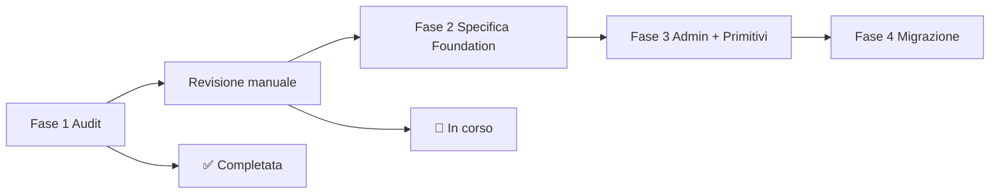

# TouringDiary — Design System Foundation

## Costituzione del progetto (documento di lavoro)

| Campo | Valore |
|-------|--------|
| **Stato** | WIP — non definitivo |
| **Versione documento** | 0.1.0 |
| **Data** | 2026-07-05 |
| **Ultimo aggiornamento contesto** | Fine Fase 1 (audit) + revisione manuale categoria Modali + decisioni Foundation approvate |
| **Scopo** | Fonte ufficiale di riferimento per riprendere lo sviluppo in qualsiasi momento, senza rifare audit |

> **Nota:** questo file è un documento di lavoro vivente. Va aggiornato ad ogni nuova decisione approvata durante la revisione manuale o lo sviluppo. Non sostituisce il codice: descrive intenzioni, vincoli e piano.

---

## Indice

1. [Perché nasce questo progetto](#1-perché-nasce-questo-progetto)
2. [Obiettivi](#2-obiettivi)
3. [Filosofia e principi guida](#3-filosofia-e-principi-guida)
4. [Stato attuale del codebase (contesto da Fase 1)](#4-stato-attuale-del-codebase-contesto-da-fase-1)
5. [Decisioni approvate](#5-decisioni-approvate)
6. [Decisioni scartate (v1 Foundation)](#6-decisioni-scartate-v1-foundation)
7. [Priorità admin vs utente finale](#7-priorità-admin-vs-utente-finale)
8. [Cosa standardizziamo e cosa no](#8-cosa-standardizziamo-e-cosa-no)
9. [Architettura dati: estendere vs nuove tabelle](#9-architettura-dati-estendere-vs-nuove-tabelle)
10. [Sezione Foundation nell'admin Design System](#10-sezione-foundation-nelladmin-design-system)
11. [Configurazione pulsanti: proprietà ammesse](#11-configurazione-pulsanti-proprietà-ammesse)
12. [Shell modali: tipologie e token](#12-shell-modali-tipologie-e-token)
13. [Inventario file e componenti per area approvata](#13-inventario-file-e-componenti-per-area-approvata)
14. [Roadmap completa](#14-roadmap-completa)
15. [Architecture Decision Records (ADR)](#15-architecture-decision-records-adr)
16. [Rischi](#16-rischi)
17. [Decisioni future e revisione manuale in corso](#17-decisioni-future-e-revisione-manuale-in-corso)
18. [Come riprendere il lavoro in una nuova sessione](#18-come-riprendere-il-lavoro-in-una-nuova-sessione)
19. [Appendice A — Sintesi audit Fase 1](#appendice-a--sintesi-audit-fase-1)
20. [Appendice B — Mappatura revisione manuale Modali](#appendice-b--mappatura-revisione-manuale-modali)
21. [Glossario](#glossario)

---

## 1. Perché nasce questo progetto

TouringDiary è un'applicazione **Tailwind-first** con ~472 file componente in `src/components/`. Lo styling è prevalentemente espresso come **classi Tailwind inline** duplicate centinaia di volte, non come componenti condivisi.

Parallelamente esiste già un **Design System runtime** (tabella Supabase `design_system_rules`, editor admin, hook `useDynamicStyles` / `useDynamicContent`) che governa soprattutto la **tipografia testuale** per chiavi semantiche (`component_key`), ma:

- copre solo ~10% dei componenti runtime;
- non governa superfici UI (background, border, padding, stati interattivi);
- coesiste con hardcoded che divergono dalle regole DB (es. `admin_btn_primary` definito ma non applicato ai bottoni reali).

**Il problema non è estetico.** L'identità visiva è già riconoscibile e coerente nel complesso (dark slate, micro-label caps, indigo/amber accent, Playfair Display). Il problema è **architetturale**:

- duplicazione di implementazioni per lo stesso ruolo UI;
- due fonti di verità (DB design system vs Tailwind inline);
- manutenzione costosa su modali (~75 portal bespoke), bottoni (~7 famiglie), drawer, conferme;
- rischio regressioni su z-index, ESC, backdrop (documentato in `docs/modal-layering.md`).

Il progetto **Design System Foundation** nasce per codificare gli **standard de facto già presenti** in token e primitive condivise, senza rifare l'identità del prodotto.

---

## 2. Obiettivi

### Obiettivi primari

1. **Costruire una Foundation** composta solo da elementi **realmente condivisi** tra più aree dell'app (non un design system enciclopedico).
2. **Eliminare le piccole differenze** tra implementazioni che svolgono la stessa funzione (es. due bottoni "Annulla" con padding/radius diversi).
3. **Centralizzare comportamenti** (overlay modale, ESC, backdrop, drawer, ruoli pulsante) mantenendo **contenuti e logiche di dominio indipendenti**.
4. **Estendere l'editor admin esistente** con una sezione Foundation che riusa la stessa UX (preview desktop/mobile, salvataggio, ripristino).
5. **Privilegiare le aree utente finale** rispetto alle schermate admin-only nella prima versione.

### Obiettivi non vincolanti (esplicitamente fuori scope v1)

- Refactor estetico globale.
- Unificare card di dominio (City Card, POI Card, Suitcase Card, ecc.).
- Standardizzare tipografia inline in tutta l'app (sarà fase successiva se approvata).
- Sostituire Tailwind con una libreria esterna (shadcn, Radix, ecc.).

### Criterio di successo finale (visione)

Un nuovo contributore può:

- usare `<FoundationButton variant="confirm" />` (nome indicativo) e ottenere lo stesso aspetto/comportamento ovunque;
- aprire una modale tramite shell Foundation senza reimplementare portal/ESC/z-index;
- modificare lo stile dei pulsanti condivisi dall'admin senza toccare decine di file.

---

## 3. Filosofia e principi guida

### Principio cardine

> **"Standardizzare i comportamenti e gli elementi condivisi, non i componenti di dominio."**

### Principi operativi

| # | Principio | Implicazione |
|---|-----------|--------------|
| P1 | **Non inventare stili** | Il riferimento è sempre un componente/pattern già esistente nel progetto |
| P2 | **Shell vs contenuto** | Shell, overlay, ESC, z-index, CloseButton → Foundation. Layout interno, form, liste → dominio |
| P3 | **Dominio autonomo** | Valigia, gallery layout, wizard content possono avere dialetti propri se coerenti internamente |
| P4 | **Minimo necessario** | Niente token o impostazioni admin senza consumatore runtime |
| P5 | **Stesso editor** | Foundation admin = estensione naturale di `DesignSystemSettings`, non un pannello diverso |
| P6 | **Utente prima** | Admin-only non blocca la Foundation v1 |
| P7 | **No big bang** | Migrazione progressiva dopo approvazione standard; audit prima, codice dopo |
| P8 | **Documento vivente** | Ogni decisione futura aggiorna questo file |

### Relazione con il Design System esistente

Il Design System attuale (sezioni `admin`, `home`, `journey`, `city`, `diary`, `suitcase` in `designRules.ts`) resta valido per **tipografia editoriale e contenuti**. La **Foundation** è un nuovo layer concettuale (`section: 'foundation'`) per **primitivi UI interattivi** condivisi: pulsanti per ruolo, shell modali, drawer chrome, wizard chrome.

Non si tratta di due design system in conflitto: Foundation è il sottoinsieme **comportamentale/strutturale**; il DS esistente resta il sottoinsieme **tipografico/editoriale** fino a eventuale convergenza futura.

---

## 4. Stato attuale del codebase (contesto da Fase 1)

### 4.1 Stack UI

| Layer | Path / tecnologia | Ruolo |
|-------|-------------------|-------|
| Tailwind v4 | `src/index.css` `@theme` | Font, z-index, spacing layout; **no** `tailwind.config` |
| CSS feature | `diaryHeaderTabs.css`, `diaryNotesEditor.css` | Eccezioni diary (tab, editor TipTap) |
| Primitive UI | `src/components/ui/` (4 file) | `CloseButton`, `CountBadge`, `HeaderPopover`, `CarouselPositionIndicator` |
| Common | `src/components/common/` (18 file) | `AnchoredPopover`, `DeleteConfirmationModal`, `SmartFilterDrawer`, ecc. |
| Design System DB | `design_system_rules` | ~134 regole seed in `designRules.ts` |
| Runtime hooks | `useDynamicStyles`, `useDynamicContent`, `useAdminStyles` | Risoluzione `component_key` → classi |
| Layering | `src/layering/`, `src/constants/zIndex.ts` | Registry z-index; lint `npm run lint:layers` |
| Modal shell | `BaseFullscreenModalShell` | **4 adottatori** su ~75 modali portal |

### 4.2 Root font-size (critico per tipografia)

- Desktop: `html { font-size: 12px }`
- Mobile: `html { font-size: 16px }`

Implica che `text-xs` ≈ 9px desktop ma 12px mobile. Coesistono `text-[9px]`, `text-[10px]`, `text-xs` per lo stesso tier visivo. **Foundation v1 non risolve questo** (decisione futura tipografia).

### 4.3 Duplicazioni ad alto impatto (audit)

| Area | Situazione |
|------|------------|
| Modali | ~75 `createPortal` bespoke; shell canonica sottoutilizzata |
| Bottoni | Nessun `Button.tsx`; ~7 famiglie Tailwind inline |
| Conferme | `DeleteConfirmationModal` (~40 consumer) + ~6 varianti bespoke |
| Drawer | `SmartFilterDrawer` + `ObservatoryFilterDrawer` |
| Toast | `SuitcaseToast` vs `GlobalAlert` (fuori scope Foundation v1 se non approvato) |
| CloseButton | ~75 modali — buona adozione |

### 4.4 Standard de facto da preservare (identità)

- Palette: dark slate (`#020617`), testo slate-200/400/500
- Accent azione: indigo-600
- Accent brand/diary: amber-500/600
- Danger: red-600
- Close: cerchio rosso (`CloseButton` primary)
- Display: Playfair Display; handwriting: Caveat (diary)

---

## 5. Decisioni approvate

Le seguenti decisioni sono **approvate** e vincolanti per la Foundation v1. Non vanno modificate senza aggiornamento esplicito di questo documento.

---

### 5.1 Shell modali

**Cosa si standardizza (ESCLUSIVAMENTE):**

- overlay
- gestione ESC (`useGlobalModalEscape` / contratto unificato)
- click sul backdrop (policy configurabile per tipo)
- animazioni apertura/chiusura
- gestione z-index (tier da `layerRegistry`)
- gestione `CloseButton` (variante, posizione)
- comportamento generale della shell (portal su `document.body`, `td-modal-overlay`)

**Cosa NON si standardizza:**

- contenuto interno delle modali
- layout specifici (tab, form, gallery grid, wizard step body)
- larghezza/altezza del contenuto oltre la configurazione della shell

**Tipologie di shell approvate:**

| Tipologia | Uso indicativo | Riferimento naturale attuale |
|-----------|----------------|------------------------------|
| **Dialog compatto** | Conferme, alert semplici | `DeleteConfirmationModal` (`max-w-sm`) |
| **Dialog medio** | Form brevi, unsaved (se migrato in futuro) | `UnsavedChangesModal` (`max-w-md`) |
| **Dialog grande** | Contenuto ricco non fullscreen | Modali `max-w-4xl` / `max-w-7xl` |
| **Fullscreen** | Sezioni app, itinerari, community | `BaseFullscreenModalShell` |

Ogni tipologia avrà configurazione dedicata nel Design System Foundation (token shell, non contenuto).

**File di riferimento implementativi attuali:**

- `src/components/modals/shell/BaseFullscreenModalShell.tsx`
- `src/components/common/DeleteConfirmationModal.tsx` (overlay compatto)
- `docs/modal-layering.md`

---

### 5.2 Modali di conferma (Annulla / Conferma)

Le modali che chiedono una **conferma semplice** (due azioni principali: annulla + conferma) condividono un **unico linguaggio grafico**.

**NON significa** renderle identiche nel contenuto o nella copy.

**Significa condividere:**

- shell (tipologia Dialog compatto)
- gerarchia visiva (icona → titolo → messaggio → azioni)
- posizione pulsanti (footer, affiancati o policy fissa)
- font, dimensioni testo, spaziature dei ruoli pulsante
- comportamento (ESC, backdrop, loading su conferma)

**Le logiche restano indipendenti** (callback, validazione, varianti semantiche danger/info/warning).

**Riferimento naturale:** `DeleteConfirmationModal` (`src/components/common/DeleteConfirmationModal.tsx`)

**Consumer principali (~40 file):** vedi [Appendice B](#appendice-b--mappatura-revisione-manuale-modali).

**Esclusi da questa famiglia (v1 o dominio separato):**

- modali multi-scelta (3+ azioni) — scartate v1
- modali celebrative — scartate v1
- modali valigia con dialetto proprio — vedi [5.3](#53-modulo-valigia)

---

### 5.3 Modulo Valigia

Le modali del modulo **Valigia** (packing list / suitcase) devono essere **coerenti tra loro**.

**NON** devono necessariamente allinearsi alle modali del resto dell'applicazione.

La Valigia mantiene il proprio **linguaggio grafico** (icone grandi, titoli `font-black uppercase`, bottoni impilati, accent rose/amber) purché sia **coerente internamente**.

**Riferimento naturale dominio valigia:** `ItemDeleteConfirmationModal`

**Implicazione Foundation:**

- Token Foundation globali per conferma **non sostituiscono** automaticamente le conferme valigia
- Eventuale sottoinsieme `section: 'foundation_suitcase'` o riuso `section: 'suitcase'` nel DS esistente per modali valigia
- Shell overlay/ESC/CloseButton della Foundation **si applicano** anche alle modali valigia (coerente con 5.1)

**File area valigia (modali):**

- `src/components/features/diary/packing_list/suitcase/ItemDeleteConfirmationModal.tsx`
- `src/components/features/diary/packing_list/suitcase/AssociationConfirmationModal.tsx`
- `src/components/features/diary/packing_list/suitcase/BlacklistModal.tsx`
- `src/components/features/diary/packing_list/suitcase/LinkSuitcaseModal.tsx`
- `src/components/features/diary/packing_list/suitcase/AiSuggestionsModal.tsx`
- `src/components/features/diary/packing_list/suitcase/CategorySetupConfigurationModal.tsx`
- `src/components/features/diary/packing_list/suitcase/RecommendedSuitcaseModal.tsx`
- `src/components/features/diary/packing_list/suitcase/CategoryMobileDialog.tsx`
- `src/components/features/diary/packing_list/SuitcaseFloatingPanel/components/SuitcaseModals.tsx`

---

### 5.4 Gallery (lightbox)

**NON** si uniforma il layout della gallery (griglia, thumbnail, metadati, like).

**Si uniformano solamente:**

- overlay
- ESC
- `CloseButton`
- comportamento apertura/chiusura (portal, scroll lock body, tier `Z_LIGHTBOX`)
- policy z-index lightbox

**Riferimento naturale:** `GalleryLightbox` (`src/components/city/gallery/GalleryLightbox.tsx`)

**Candidato parziale da allineare (solo shell/comportamento):** carousel in `src/components/modals/poiDetail/PoiImageSection.tsx`

---

### 5.5 Wizard

**NON** si crea un Wizard unico.

**Si condividono eventualmente soltanto:**

- barra degli step (`WizardStepIndicator`)
- footer navigazione (`CollaborationWizardFooter` come riferimento pattern)
- pulsanti di navigazione per ruolo (Indietro, Continua, Chiudi) — allineati a [5.6 Pulsanti](#56-pulsanti)

**Ogni wizard** conserva contenuti e logiche proprie.

**Riferimenti naturali:**

- `src/components/collaboration/WizardStepIndicator.tsx`
- `src/components/collaboration/CollaborationWizardFooter.tsx`
- `src/components/collaboration/CollaborationShareModal.tsx` (orchestrazione)

**Altri wizard (contenuto indipendente):**

- `src/components/modals/AroundMeWizard.tsx`
- `src/components/layout/OnboardingWizard.tsx`

---

### 5.6 Drawer

I **drawer laterali** vengono standardizzati per il **chrome** (non il contenuto filtri).

**Cosa si standardizza:**

- apertura / chiusura
- overlay / backdrop
- header (titolo, close)
- footer (Reset, Applica o equivalenti)
- pulsanti standard del footer (ruoli → Foundation Buttons)
- animazioni slide-in

**Il contenuto resta indipendente** (filtri POI, filtri osservatorio, ecc.).

**Riferimento naturale:** `SmartFilterDrawer` (`src/components/common/SmartFilterDrawer.tsx`)

**Secondo adottatore da allineare:** `ObservatoryFilterDrawer` (`src/components/admin/observatory/ObservatoryFilterDrawer.tsx`)

---

### 5.7 Pulsanti

I pulsanti condivisi dell'applicazione entrano nella Foundation.

**Obiettivo:** eliminare le piccole differenze tra pulsanti con la **stessa funzione semantica**.

**Ruoli approvati per standardizzazione v1** (lista iniziale, estendibile con decisione documentata):

| Ruolo | Esempi label | Variante semantica |
|-------|--------------|-------------------|
| `primary` | Continua, Conferma, Salva, Applica | azione principale |
| `secondary` | Annulla, Chiudi, Indietro | azione neutra / dismiss |
| `danger` | Elimina, Svuota | azione distruttiva |
| `ghost` | — | toolbar, icon-adjacent |
| `outline` | Reset | azione secondaria enfatica |

**Per ogni ruolo, un unico standard** per:

- font, peso, dimensione testo
- padding, border radius
- colori (default, hover, disabled)
- focus ring
- border, shadow (se applicabili)
- stato loading (spinner + label)

**NON si standardizzano in v1** (salvo decisione futura):

- pulsanti con identità forte di dominio (es. CTA amber diary hero, compass explore)
- filter chip-toggle (semantica toggle, non button classico)
- `CloseButton` (già primitivo separato — resta com'è, eventuale allineamento token)

**Riferimenti naturali attuali (da convergere):**

- Conferma modale: `DeleteConfirmationModal` footer buttons
- Wizard: `CollaborationWizardFooter` — `PRIMARY_BUTTON_CLASS` + secondari inline
- Modali generiche: coppia `bg-indigo-600` + `bg-slate-800` ripetuta ~90 file

**Nota audit:** `admin_btn_primary` in `designRules.ts` copre solo tipografia testo, non shell bottone — Foundation deve modellare **css_class** completo per superficie bottone.

---

## 6. Decisioni scartate (v1 Foundation)

Le seguenti categorie **NON** entrano nella prima versione della Foundation. Possono essere rivalutate in versioni successive.

| Categoria | Esempi nel codebase | Motivo scarto v1 |
|-----------|---------------------|------------------|
| **Modali celebrative** | `LevelUpModal`, `reviewSuccess` in `CoreModals`, success in `DiaryModals`, `GallerySuccessModal` | Identità evento-specifica; basso riuso strutturale |
| **Modali multi-scelta** | `UnsavedChangesModal`, `LimitWarningModal`, `QuotaExceededModal`, `RemoveItemModal` | Semantica 3+ azioni; rischio appiattimento UX |
| **Alert solo OK** | `DiaryHeaderInvalidDateModal` | Un solo caso dedicato; ROI primitivo basso |
| **Modali progresso** | `BulkFixProgressModal` | Admin-only, metriche dominio-specifiche |
| **Componenti esclusivamente admin** | Tabelle admin, modali form admin non riusate in area utente | Priorità utente finale — vedi §7 |

**Nota:** lo scarto admin non significa "mai". Significa **non bloccare** le macrofasi Foundation 2–4.

---

## 7. Priorità admin vs utente finale

### Decisione architetturale

Il Design System Foundation **privilegia tutto ciò che vede l'utente finale** (home, città, diario, valigia, collaborazione, shop, profilo, modali globali).

Le schermate **esclusivamente amministrative** non sono priorità per la v1.

Potranno essere uniformate **successivamente**, senza rallentare lo sviluppo della Foundation.

### Eccezione

I componenti admin **riutilizzati anche in area utente** entrano in Foundation con priorità utente.

**Esempio:** `SmartFilterDrawer` — usato in `CityCategoryTab` (utente) e `AdminPoiManager` / `ImportDashboard` (admin). **Entra in Foundation.**

**Controesempio:** `ObservatoryFilterDrawer` — solo osservatorio admin. **Chrome drawer può seguire Foundation; contenuto non prioritario.**

**Controesempio:** `DeleteUserModal` — solo admin. **Non prioritario v1** (resta fuori migrazione conferma globale fino a fase admin).

---

## 8. Cosa standardizziamo e cosa no

### Matrice riepilogativa

| Elemento | Standardizzazione v1 | Scope |
|----------|---------------------|-------|
| Shell modali (4 tipi) | ✅ Sì | Comportamento + chrome |
| Contenuto modali | ❌ No | Per dominio |
| Conferma binaria | ✅ Sì | Linguaggio grafico condiviso |
| Conferma valigia | ✅ Sì (interno modulo) | Dialetto valigia, non globale |
| Gallery layout | ❌ No | — |
| Gallery overlay/ESC | ✅ Sì | Comportamento |
| Wizard unico | ❌ No | — |
| Wizard step bar + footer | ✅ Parziale | Chrome + pulsanti ruolo |
| Drawer chrome | ✅ Sì | Apertura, header, footer |
| Drawer contenuto filtri | ❌ No | Per contesto |
| Pulsanti per ruolo | ✅ Sì | Foundation Buttons |
| Card (City, POI, Diary, Shop…) | ❌ No | Domini diversi |
| Tipografia globale | ❌ No v1 | Audit fatto; decisione futura |
| Badge / Chip / Tag | ❌ No v1 | Revisione manuale non completata |
| Input / Select / Switch | ❌ No v1 | Revisione manuale non completata |
| Toast / Notifiche | ❌ No v1 | Revisione manuale non completata |
| Tabelle admin | ❌ No v1 | Admin non prioritario |
| CloseButton | ✅ Già esistente | Mantenere; integrare in shell contract |

---

## 9. Architettura dati: estendere vs nuove tabelle

### 9.1 Analisi strutture esistenti

#### Tabella `design_system_rules`

Schema attuale (`src/types/designSystem.ts`, `src/types/supabase.ts`):

| Colonna | Uso attuale |
|---------|-------------|
| `component_key` | Chiave univoca (upsert on conflict) |
| `section` | Raggruppamento editor (`admin`, `home`, `diary`, `suitcase`, …) |
| `element_name` | Label umana in admin |
| `font_family`, `text_size`, `font_weight`, `line_height`, `text_transform`, `tracking` | Tipografia |
| `css_class` | Utility layout/superficie (es. `admin_section_card` container completo) |
| `color_class` | Colore testo **o** bg (limite noto) |
| `effect_class` | Shadow, italic, glow |
| `preview_text` | Testo preview editor |

**Runtime:** `ConfigContext` carica regole in `configs.design_system_rules`; `constructClassName()` in `useDynamicStyles.ts` compone le classi.

**Editor:** `DesignSystemSettings.tsx` → `SideEditorPanel` → `StyleEditor` + `ComponentPreviewHost`; salvataggio via `updateDesignSystemRule()`.

#### Tabella `global_settings`

Schema: `key` (PK), `value` (JSON), `updated_at`.

Usata per configurazioni blob (POI categories, storage limits, collaboration config, ecc.). Editor: `GlobalSettingsPanel` con form JSON/strutturato per chiave — **UX diversa** dal Design System per-component.

### 9.2 Decisione: estendere `design_system_rules` (primaria)

**La Foundation userà `design_system_rules` con `section: 'foundation'`** (e sottosezioni logiche via prefisso `component_key`).

**Motivazioni:**

1. **Stessa UX admin richiesta** — lista componenti, editor per regola, preview desktop/mobile, salvataggio per `component_key`, ripristino da seed: tutto già implementato.
2. **`css_class` già supporta superfici complete** — precedente: `admin_section_card`, shell modali Foundation possono usare lo stesso pattern del container.
3. **Coppia desktop/mobile** — convenzione `_mobile` già consolidata (`admin_h1` / `admin_h1_mobile`).
4. **Runtime già cablato** — `useDynamicStyles('foundation_btn_confirm')` senza nuovo servizio.
5. **Seed e migration** — pattern consolidato (`supabase/migrations/*_design_system_*.sql`, `designRules.ts`).

**Convenzione `component_key` proposta:**

```
foundation_modal_shell_compact
foundation_modal_shell_compact_mobile
foundation_modal_shell_medium
foundation_modal_shell_large
foundation_modal_shell_fullscreen
foundation_btn_primary
foundation_btn_secondary
foundation_btn_danger
foundation_btn_ghost
foundation_btn_outline
foundation_confirm_dialog_shell
foundation_confirm_icon_wrapper
foundation_confirm_title
foundation_confirm_message
foundation_drawer_shell
foundation_drawer_header
foundation_drawer_footer
foundation_wizard_step_indicator
foundation_wizard_footer
foundation_lightbox_overlay
```

### 9.3 Uso limitato di `global_settings` (secondaria, opzionale)

**Proposta:** chiave opzionale `foundation_editor_meta` (JSON) solo per:

- metadati editor non stilistici (`preview_type`, mapping preview component);
- flag feature (`foundation_migration_enabled`);
- **NON** per valori di stile (restano in `design_system_rules`).

**Motivo:** `StyleRuleEditorMeta` oggi è in `editorTypes.ts` lato client. Se serve persistenza meta preview per nuovi tipi Foundation, `global_settings` è più adatto di una nuova tabella. **Stile sempre su `design_system_rules`.**

### 9.4 Nuova tabella — NON necessaria in v1

**Non si introduce una nuova tabella** salvo requisiti futuri non coperti:

| Requisito ipotetico | Perché non serve ora |
|---------------------|----------------------|
| Versioning storico regole | `updated_at` + git seed sufficienti per v1 |
| Relazioni N:N token | Ogni token = una riga `component_key` |
| Tipi non mappabili su StyleRule | Foundation v1 = Tailwind class strings come oggi |

**Se in futuro** servisse separare `text-color` e `bg-color` (nota già in `designSystem.ts`), la migration sarebbe `ALTER TABLE design_system_rules ADD COLUMN bg_class` — **estensione tabella esistente**, non nuova entità.

### 9.5 Estensioni codice (non DB) necessarie

| File | Estensione |
|------|------------|
| `src/data/system/designTokens.ts` | Token Foundation (radius preset, padding preset, stati focus) |
| `src/data/system/designRules.ts` | Seed regole `section: 'foundation'` |
| `src/components/admin/design/ComponentPreviewHost.tsx` | Preview per tipi shell, button, drawer |
| `src/components/admin/design/editorTypes.ts` | `preview_type: 'modal_shell' \| 'button' \| 'drawer'` |
| `supabase/migrations/` | INSERT seed Foundation rules |

---

## 10. Sezione Foundation nell'admin Design System

### 10.1 Posizionamento

**Path admin:** Impostazioni Globali → tab **Design System** (`SettingsPage.tsx` → `DesignSystemSettings.tsx`)

Oggi `DesignSystemSettings` organizza regole per **tab di sezione** (`admin`, `home`, `journey`, `city`, `diary`, `suitcase`, …) derivate da `rule.section`.

### 10.2 Requisito UX (vincolante)

La nuova sezione **Foundation** deve comportarsi **ESATTAMENTE** come le sezioni esistenti:

| Capacità | Implementazione attuale da riusare |
|----------|-----------------------------------|
| Lista elementi per sezione | Tab `foundation` in `DesignSystemSettings` |
| Apertura editor slide-over | `SideEditorPanel` |
| Preview live | `ComponentPreviewHost` |
| Toggle Desktop / Mobile | `SideEditorPanel` device toggle |
| Modifica proprietà | `StyleEditor` (+ eventuale estensione campi shell) |
| Salvataggio | `updateDesignSystemRule` + `refreshConfig` |
| Ripristino | Rebuild da seed / `rebuildDesignSystemCache` |
| Annulla modifiche locali | Stesso flusso `editedRules` / `originalRules` |

**NON deve sembrare un pannello diverso.** È una **naturale estensione** del tab Design System.

### 10.3 Implementazione UI prevista (solo specifica, no codice)

1. Aggiungere tab **Foundation** accanto alle sezioni esistenti (o sotto-gruppi: Modali, Pulsanti, Drawer, Wizard, Lightbox).
2. Ogni voce = una riga `design_system_rules` con `section: 'foundation'`.
3. `ComponentPreviewHost` esteso con preview interattive:
   - **Button:** rendering `<button>` con classi composte + stati hover/disabled simulati
   - **Modal shell:** frame vuoto con overlay finto e pannello dimensionato
   - **Drawer:** frame laterale con header/footer
4. Metadati preview in `editorTypes.ts` (non DB) per scegliere il renderer.

### 10.4 File coinvolti (fase admin)

| File | Azione |
|------|--------|
| `src/components/admin/design/DesignSystemSettings.tsx` | Tab Foundation, filtro sezione |
| `src/components/admin/design/ComponentPreviewHost.tsx` | Nuovi preview types |
| `src/components/admin/design/StyleEditor.tsx` | Eventuale modalità "solo utility" per shell |
| `src/components/admin/design/editorTypes.ts` | Meta preview Foundation |
| `src/data/system/designRules.ts` | Seed Foundation |
| `src/data/system/designTokens.ts` | Whitelist token Foundation |

---

## 11. Configurazione pulsanti: proprietà ammesse

### 11.1 Principio

**Massima flessibilità con il minimo numero di impostazioni.** Ogni campo esposto in admin deve avere un consumatore runtime nel componente `FoundationButton` (nome indicativo).

### 11.2 Modello dati per ruolo pulsante

Ogni ruolo (`foundation_btn_primary`, ecc.) = **una riga** `design_system_rules`:

| Campo StyleRule | Proprietà configurabile | Motivazione |
|-----------------|-------------------------|-------------|
| `font_family` | Famiglia | Coerenza tipografica |
| `text_size` | Dimensione testo | Elimina drift `text-xs` vs `text-sm` |
| `font_weight` | Peso | Elimina drift bold/semibold |
| `text_transform` | Maiuscole | Solo se ruolo lo richiede (es. SALVA caps) |
| `tracking` | Letter-spacing | Micro-CTA |
| `line_height` | Interlinea | Allineamento verticale con icona |
| `color_class` | Colore testo | Stato default |
| `css_class` | **Superficie completa** | `bg-*`, `hover:bg-*`, `padding`, `rounded-*`, `border`, `shadow`, `disabled:opacity-*`, `focus-visible:ring-*`, `gap`, `flex` |
| `effect_class` | Effetti aggiuntivi | Shadow enfasi |

### 11.3 Proprietà NON esposte separatamente in admin (v1)

| Proprietà | Motivo esclusione |
|-----------|-------------------|
| Hover come campo separato | Incluso in `css_class` Tailwind (`hover:bg-*`) — un campo, un posto |
| Disabled come campo separato | Pattern `disabled:opacity-50 disabled:cursor-not-allowed` dentro `css_class` |
| Focus come campo separato | `focus-visible:ring-* focus-visible:border-*` in `css_class` |
| Padding orizzontale/verticale separati | Preset in `css_class` o `UTILITY_CSS_PRESETS` estesi |
| Icon size | Responsabilità `IconButton` composizione, non token testo |

### 11.4 Stati runtime (codice, non DB)

Il componente runtime applica **stati** non duplicati in DB:

| Stato | Comportamento |
|-------|---------------|
| `disabled` | Applica classi `disabled:` già nel token |
| `loading` | Spinner + `loadingLabel`; disabilita click |
| `type="submit"` | Pass-through HTML |

### 11.5 Mappatura ruoli semantici → token

| Ruolo semantico | `component_key` | Riferimento visivo attuale |
|---------------|-----------------|----------------------------|
| Azione principale | `foundation_btn_primary` | `bg-indigo-600 hover:bg-indigo-500`, `DeleteConfirmationModal` confirm info variant |
| Secondaria / annulla | `foundation_btn_secondary` | `bg-slate-800 hover:bg-slate-700`, cancel modali |
| Pericolo | `foundation_btn_danger` | `bg-red-600 hover:bg-red-500` |
| Ghost | `foundation_btn_ghost` | Toolbar `text-slate-400 hover:text-white` |
| Outline / reset | `foundation_btn_outline` | `border border-slate-700`, drawer reset |

**Label testuali** (Continua, Salva, …) **non sono token** — sono copy dei componenti. **Lo stile** del ruolo è tokenizzato.

### 11.6 Coppia mobile

Ogni ruolo avrà `foundation_btn_primary_mobile` se il audit rileva drift mobile; altrimenti si eredita desktop fino a evidenza contraria.

---

## 12. Shell modali: tipologie e token

### 12.1 Token per tipologia

Ogni tipologia = almeno una regola `css_class` per il **pannello** + regole satellite opzionali per overlay se non coperto da `td-modal-overlay` globale.

| Tipologia | `component_key` | Parametri concettuali (in `css_class`) |
|-----------|-----------------|----------------------------------------|
| Compatto | `foundation_modal_shell_compact` | `max-w-sm`, `rounded-2xl`, padding pannello |
| Medio | `foundation_modal_shell_medium` | `max-w-md` |
| Grande | `foundation_modal_shell_large` | `max-w-4xl` / `max-w-7xl` configurabile |
| Fullscreen | `foundation_modal_shell_fullscreen` | `h-full`, `max-w-7xl` o `max-w-full`, border radius responsive |

### 12.2 Comportamento (codice Foundation, non DB)

| Comportamento | Fonte canonica |
|---------------|----------------|
| Portal `document.body` | `BaseFullscreenModalShell` |
| `td-modal-overlay` | `src/index.css` |
| ESC | `useGlobalModalEscape` |
| Z-index overlay/panel | `Z_OVERLAY`, `Z_MODAL`, `Z_MODAL_NESTED` |
| CloseButton variant/position | Props shell con default da Foundation |
| `closeOnOverlayClick` | Prop per tipologia (conferme: spesso true) |
| Animazioni | `animate-in fade-in zoom-in-95` (standard de facto) |

### 12.3 Conferma binaria — token satellite

Oltre alla shell compact, token per gerarchia interna (opzionale, se non coperti da componente `ConfirmDialog`):

- `foundation_confirm_icon_wrapper`
- `foundation_confirm_title`
- `foundation_confirm_message`
- `foundation_confirm_footer`

Riferimento: struttura interna di `DeleteConfirmationModal`.

---

## 13. Inventario file e componenti per area approvata

### 13.1 Shell modali — candidati migrazione (priorità utente)

**Già sulla shell:**

- `src/components/modals/ItinerariesModal.tsx`
- `src/components/modals/GlobalSectionView.tsx`
- `src/components/layout/StaticPage.tsx`

**Alta priorità utente (fullscreen / large):**

- `src/components/modals/PoiDetailModal.tsx`
- `src/components/modals/CityInfoModal.tsx`
- `src/components/modals/AuthModal.tsx`
- `src/components/modals/ExportModal.tsx`
- `src/components/collaboration/CollaborationShareModal.tsx`
- `src/components/modals/AiItineraryModal.tsx`
- `src/components/modals/RoadbookModal.tsx`
- `src/components/shop/ShopBioOverlay.tsx`
- `src/components/shop/ProductDetailOverlay.tsx`

**Infrastruttura:**

- `src/components/modals/shell/BaseFullscreenModalShell.tsx` — **evolvere**, non sostituire
- `src/hooks/useGlobalModalEscape.ts`
- `src/constants/zIndex.ts`, `src/layering/layerRegistry.ts`

### 13.2 Conferma binaria

**Primitivo:**

- `src/components/common/DeleteConfirmationModal.tsx` — **evolvere** verso `FoundationConfirmDialog` o applicare token

**Bespoke da valutare in migrazione (post-approvazione):**

- `src/components/modals/ConfirmClearModal.tsx`
- `src/components/modals/DateChangeWarningModal.tsx`
- `src/components/modals/DuplicateResolutionModal.tsx`
- `src/components/features/diary/packing_list/suitcase/AssociationConfirmationModal.tsx`

**Admin non prioritario v1:**

- `src/components/admin/userManager/DeleteUserModal.tsx`
- `src/components/admin/poiManager/RegenerateConfirmModal.tsx`

### 13.3 Drawer

- `src/components/common/SmartFilterDrawer.tsx` — riferimento
- `src/components/admin/observatory/ObservatoryFilterDrawer.tsx` — allineamento chrome

### 13.4 Gallery lightbox

- `src/components/city/gallery/GalleryLightbox.tsx`
- `src/components/modals/poiDetail/PoiImageSection.tsx` (solo comportamento)

### 13.5 Wizard chrome

- `src/components/collaboration/WizardStepIndicator.tsx`
- `src/components/collaboration/CollaborationWizardFooter.tsx`
- Consumer: `CollaborationShareModal.tsx`, `AroundMeWizard.tsx`, `OnboardingWizard.tsx`

### 13.6 Pulsanti — file ad alto impatto

- `src/components/common/DeleteConfirmationModal.tsx` (footer)
- `src/components/collaboration/CollaborationWizardFooter.tsx`
- `src/components/modals/UnsavedChangesModal.tsx` (futuro, se mai migrato)
- Decine di modali con coppia indigo/slate inline — migrazione graduale Fase 4

### 13.7 Valigia — coerenza interna

- `src/components/features/diary/packing_list/suitcase/ItemDeleteConfirmationModal.tsx` (riferimento dialetto)
- `src/components/features/diary/packing_list/SuitcaseFloatingPanel/components/SuitcaseModals.tsx`
- Regole DS esistenti `section: 'suitcase'` in `designRules.ts`

---

## 14. Roadmap completa

### Panoramica macrofasi



---

### MACROFASE 0 — Documentazione e governance

**Stato:** in corso (questo documento)

| | |
|---|---|
| **Obiettivi** | Costituire fonte ufficiale; registrare decisioni; abilitare ripresa lavoro |
| **Attività** | Mantenere `FOUNDATION_CONSTITUTION_WIP.md`; aggiornare a ogni decisione |
| **File nuovi** | `docs/design-system-foundation/FOUNDATION_CONSTITUTION_WIP.md` |
| **Dipendenze** | Nessuna |
| **Criteri completamento** | Documento approvato dal product owner; revisione manuale categorie completata |

---

### MACROFASE 1 — Audit e revisione manuale

**Stato:** Audit ✅ | Revisione 🔄

| | |
|---|---|
| **Obiettivi** | Censire UI; identificare famiglie; decisioni approvate/scartate |
| **Attività completate** | Audit architetturale completo; revisione categoria **Modali**; decisioni Foundation in §5–6 |
| **Attività residue** | Revisione manuale categorie rimanenti (Pulsanti dettaglio, Input, Card shell, Tipografia, Badge, …) — **una categoria per volta** |
| **File coinvolti** | Tutto `src/components/` (lettura); nessuna modifica codice |
| **Dipendenze** | Macrofase 0 |
| **Criteri completamento** | Tutte le categorie UI revisionate o esplicitamente posticipate con motivazione in §17 |

---

### MACROFASE 2 — Specifica tecnica Foundation

**Stato:** non iniziata (bloccata da completamento decisionale)

| | |
|---|---|
| **Obiettivi** | Tradurre decisioni approvate in contratti tecnici: API componenti, naming token, matrice migrazione |
| **Attività** | Definire API `FoundationModalShell`, `FoundationConfirmDialog`, `FoundationButton`, `FoundationDrawer`, `FoundationLightboxOverlay`, `FoundationWizardChrome`; definire seed `component_key` completo; aggiornare `designTokens.ts` |
| **File nuovi** | `docs/design-system-foundation/TECHNICAL_SPEC.md` (da creare) |
| **File modificati** | Questo documento (versione + ADR) |
| **Dipendenze** | Macrofase 1 decisioni su categorie toccate |
| **Criteri completamento** | Spec approvata; elenco token definitivo; nessuna ambiguità su shell 4 tipi |

---

### MACROFASE 3 — Admin Foundation + primitivi runtime

**Stato:** non iniziata

| | |
|---|---|
| **Obiettivi** | Sezione Foundation in admin; componenti runtime che consumano token |
| **Attività** | |
| 3.1 | Migration SQL seed regole `section: 'foundation'` |
| 3.2 | Estendere `designTokens.ts`, `designRules.ts` |
| 3.3 | Tab Foundation in `DesignSystemSettings` |
| 3.4 | Preview types in `ComponentPreviewHost` |
| 3.5 | Creare primitivi in `src/components/ui/foundation/` (o `src/components/foundation/`) |
| 3.6 | Hook `useFoundationStyles(key)` wrapper su `useDynamicStyles` |
| **File nuovi** | |
| | `src/components/ui/foundation/FoundationButton.tsx` |
| | `src/components/ui/foundation/FoundationModalShell.tsx` |
| | `src/components/ui/foundation/FoundationConfirmDialog.tsx` |
| | `src/components/ui/foundation/FoundationDrawer.tsx` |
| | `src/components/ui/foundation/FoundationWizardStepBar.tsx` |
| | `src/components/ui/foundation/FoundationWizardFooter.tsx` |
| | `src/components/ui/foundation/FoundationLightboxShell.tsx` |
| | `src/hooks/useFoundationStyles.ts` |
| | `supabase/migrations/YYYYMMDD_foundation_seed_rules.sql` |
| **File modificati** | |
| | `src/components/admin/design/DesignSystemSettings.tsx` |
| | `src/components/admin/design/ComponentPreviewHost.tsx` |
| | `src/components/admin/design/editorTypes.ts` |
| | `src/data/system/designTokens.ts` |
| | `src/data/system/designRules.ts` |
| | `src/components/modals/shell/BaseFullscreenModalShell.tsx` (refactor per consumare token) |
| **Dipendenze** | Macrofase 2 |
| **Criteri completamento** | Admin: ogni token Foundation editabile con preview desktop/mobile; runtime: primitivi usabili in isolamento; test manuale admin save → refresh → classi applicate |

---

### MACROFASE 4 — Migrazione progressiva

**Stato:** non iniziata — **solo dopo approvazione esplicita standard**

| | |
|---|---|
| **Obiettivi** | Sostituire hardcoded con primitivi Foundation per area approvata |
| **Ordine migrazione proposto** | |
| 4.1 | Pulsanti ruolo (impatto trasversale, basso rischio visivo se token = de facto) |
| 4.2 | Shell modali utente (fullscreen shell adottatori) |
| 4.3 | Conferma binaria (consumer `DeleteConfirmationModal`) |
| 4.4 | Drawer (`ObservatoryFilterDrawer` chrome → `SmartFilterDrawer` pattern) |
| 4.5 | Gallery lightbox comportamento |
| 4.6 | Wizard chrome (collaboration prima) |
| 4.7 | Coerenza interna modali valigia |
| 4.8 | Admin (solo componenti riusati in area utente) |
| **File modificati** | Centinaia — per sprint; lista prioritaria in §13 |
| **Dipendenze** | Macrofase 3 + approvazione esplicita per ogni sotto-sprint |
| **Criteri completamento** | Per ogni sotto-sprint: zero regressioni layering (`npm run lint:layers`); review visiva; nessun nuovo hardcoded per il ruolo migrato |

---

### MACROFASE 5 — Manutenzione e estensioni (post-v1)

| | |
|---|---|
| **Obiettivi** | Valutare categorie scartate v1; tipografia; input; toast |
| **Dipendenze** | Macrofase 4 stabile |
| **Criteri** | Nuove ADR per ogni estensione |

---

## 15. Architecture Decision Records (ADR)

### ADR-001 — Foundation vs Design System enciclopedico

| | |
|---|---|
| **Decisione** | Creare una **Foundation** minima di primitivi condivisi, non un design system completo |
| **Motivazione** | Audit: identità già coerente; problema è duplicazione implementativa |
| **Alternative** | Adottare shadcn/Radix; refactor estetico globale |
| **Scartate perché** | Cambio stack troppo invasivo; non risolve token DB esistente |
| **Impatto** | Scope limitato, migrazione incrementale |

---

### ADR-002 — Shell modale vs contenuto

| | |
|---|---|
| **Decisione** | Standardizzare solo shell (overlay, ESC, z-index, CloseButton, animazioni) |
| **Motivazione** | ~75 modali diverse per contenuto; un unico layout non è desiderabile |
| **Alternative** | Unificare tutte le modali in un componente |
| **Scartate perché** | Appiattirebbe domini (POI vs auth vs export) |
| **Impatto** | `BaseFullscreenModalShell` diventa contratto centrale |

---

### ADR-003 — Quattro tipologie shell

| | |
|---|---|
| **Decisione** | Compact, Medium, Large, Fullscreen — ciascuna configurabile in DS |
| **Motivazione** | Audit rileva 4 cluster dimensionali reali |
| **Alternative** | Solo fullscreen; solo una dimensione |
| **Scartate perché** | Conferme compatte su fullscreen sono UX scadente |
| **Impatto** | 4×2 regole potenziali (desktop/mobile) |

---

### ADR-004 — Conferma binaria con linguaggio condiviso

| | |
|---|---|
| **Decisione** | `DeleteConfirmationModal` come riferimento grafico per Annulla/Conferma |
| **Motivazione** | ~40 consumer; varianti semantiche già presenti |
| **Alternative** | Lasciare ~6 implementazioni bespoke |
| **Scartate perché** | Drift visivo e manutenzione |
| **Impatto** | `ConfirmClearModal`, ecc. convergono nel tempo |

---

### ADR-005 — Valigia: dialetto interno

| | |
|---|---|
| **Decisione** | Modali valigia coerenti tra loro, non necessariamente uguali al resto app |
| **Motivazione** | `ItemDeleteConfirmationModal` ha identità forte; prodotto diary-centric |
| **Alternative** | Forzare `DeleteConfirmationModal` ovunque |
| **Scartate perché** | Perdita identità modulo valigia |
| **Impatto** | Token suitcase separati; shell Foundation comune |

---

### ADR-006 — Gallery: solo comportamento lightbox

| | |
|---|---|
| **Decisione** | Uniformare overlay/ESC/CloseButton, non layout gallery |
| **Motivazione** | Layout POI vs community gallery diversi per requisito |
| **Alternative** | Unificare `GalleryLightbox` e `PoiImageSection` |
| **Scartate perché** | Domini diversi |
| **Impatto** | Tier `Z_LIGHTBOX` condiviso |

---

### ADR-007 — Wizard: chrome only

| | |
|---|---|
| **Decisione** | Condividere step bar + footer + pulsanti ruolo, non wizard unico |
| **Motivazione** | Onboarding, AroundMe, Collaboration hanno flussi incomparabili |
| **Alternative** | `FoundationWizard` con step configurabili |
| **Scartate perché** | Over-engineering |
| **Impatto** | Estrazione `WizardStepIndicator` + footer pattern |

---

### ADR-008 — Drawer standardizzato

| | |
|---|---|
| **Decisione** | Chrome drawer unificato (`SmartFilterDrawer` riferimento) |
| **Motivazione** | Stessa semantica filtri in utente e admin |
| **Alternative** | Lasciare 2 drawer |
| **Scartate perché** | Duplicazione apertura/animazione/footer |
| **Impatto** | `ObservatoryFilterDrawer` allineamento |

---

### ADR-009 — Pulsanti per ruolo semantico

| | |
|---|---|
| **Decisione** | Token per ruolo (primary, secondary, danger, ghost, outline) |
| **Motivazione** | Stesso ruolo, stili diversi in ~90+ file |
| **Alternative** | Solo documentazione, no primitivo |
| **Scartate perché** | Non elimina drift |
| **Impatto** | `FoundationButton` + regole DB |

---

### ADR-010 — Persistenza su `design_system_rules`

| | |
|---|---|
| **Decisione** | Estendere tabella esistente con `section: 'foundation'` |
| **Motivazione** | Stessa UX admin; runtime già cablato; `css_class` per superfici |
| **Alternative** | Nuova tabella `foundation_tokens`; solo `global_settings` JSON |
| **Scartate perché** | Nuova tabella = migrazione infra senza beneficio v1; global_settings = UX diversa |
| **Impatto** | Seed SQL + `designRules.ts` |

---

### ADR-011 — Priorità utente finale su admin

| | |
|---|---|
| **Decisione** | v1 Foundation non blocca su admin-only |
| **Motivazione** | Utenti finali vedono il drift più critico (modali, CTA) |
| **Alternative** | Migrazione admin-first |
| **Scartate perché** | Admin ha meno visibilità business |
| **Impatto** | `DeleteUserModal`, `BulkFixProgressModal` fuori v1 |

---

### ADR-012 — Esclusioni v1 esplicite

| | |
|---|---|
| **Decisione** | Escludere celebrative, multi-scelta, OK-only, progresso, admin-only |
| **Motivazione** | ROI basso o rischio alto per prima release Foundation |
| **Alternative** | Foundation "completa" day one |
| **Scartate perché** | Scope creep |
| **Impatto** | Roadmap Fase 5 per estensioni |

---

## 16. Rischi

| ID | Rischio | Probabilità | Impatto | Mitigazione |
|----|---------|-------------|---------|-------------|
| R1 | Regressioni z-index / modali annidate | Alta | Alto | `lint:layers`; migrare per tier; test manuali nested confirm |
| R2 | ESC doppio o non catturato | Media | Alto | Un solo `useGlobalModalEscape` per shell; `CloseButton withEscape={false}` su shell |
| R3 | Drift mobile/desktop (root 12px/16px) | Alta | Medio | Coppia `_mobile` per ogni token; preview admin obbligatoria |
| R4 | `color_class` usato per bg e text | Media | Medio | Foundation documenta convenzione; futuro `bg_class` se necessario |
| R5 | Admin editor insufficiente per stati hover | Media | Medio | Preview con pseudo-stati; `css_class` include hover Tailwind |
| R6 | Migrazione big-bang | Bassa | Alto | Macrofase 4 a sprint; no merge senza approvazione |
| R7 | Conflitto Foundation vs regole suitcase esistenti | Media | Medio | Namespace `foundation_*` vs `suitcase_*` chiaro |
| R8 | `admin_btn_primary` legacy confusion | Media | Basso | Foundation sostituisce concetto per app utente; admin legacy posticipato |
| R9 | Perdita identità valigia | Bassa | Alto | ADR-005; review visiva obbligatoria modulo valigia |
| R10 | Documento non aggiornato | Media | Alto | Aggiornare questo file a ogni decisione |

---

## 17. Decisioni future e revisione manuale in corso

### Categorie audit completate — revisione manuale

| Categoria | Stato revisione | Esito |
|-----------|------------------|-------|
| **Modali** | ✅ Completata | Decisioni §5.1–5.5, §6 |
| **Pulsanti** | ✅ Decisione approvata | §5.6 (dettaglio per file: da completare in revisione se necessario) |
| Tipografia | ⏳ Pending | Audit disponibile Appendice A |
| Input / Select / Switch | ⏳ Pending | |
| Badge / Chip / Tag | ⏳ Pending | |
| Card | ⏳ Pending | Attenzione: non raggruppare per sola somiglianza visiva |
| Tabelle | ⏳ Pending | Probabilmente post-v1 (admin) |
| Toast / Notifiche | ⏳ Pending | |
| Tooltip / Divider | ⏳ Pending | |
| Header / Sidebar / Footer | ⏳ Pending | |

### Domande aperte (non decise)

1. **Nome sezione admin:** "Foundation" vs "Core UI" — da decidere prima Macrofase 3.
2. **Path componenti:** `src/components/ui/foundation/` vs `src/components/foundation/` — da decidere in Macrofase 2.
3. **Tipografia in Foundation:** entrare in v1 o fase separata?
4. **`CloseButton`:** resta primitivo autonomo o diventa variante `FoundationButton` icon?
5. **Focus ring unico:** indigo vs amber — audit rileva split; decisione non ancora presa.
6. **Nuova colonna `bg_class`:** necessaria per pulsanti o sufficiente `css_class`?

---

## 18. Come riprendere il lavoro in una nuova sessione

1. Leggere questo file: `docs/design-system-foundation/FOUNDATION_CONSTITUTION_WIP.md`
2. Verificare §17 per categorie revisione pendenti
3. **Non modificare codice** finché Macrofase 2 non è approvata
4. Per contesto layering modali: `docs/modal-layering.md`
5. Per audit quantitativo: Appendice A sotto
6. Per implementazione admin esistente: `src/components/admin/design/DesignSystemSettings.tsx`
7. Per seed regole: `src/data/system/designRules.ts`
8. Aggiornare versione documento e data in testa al file ad ogni decisione

**Prompt suggerito per nuova chat:**

> Stiamo sviluppando il Design System Foundation di TouringDiary. Leggi `docs/design-system-foundation/FOUNDATION_CONSTITUTION_WIP.md` come fonte ufficiale. [Descrivi macrofase e task specifico].

---

## Appendice A — Sintesi audit Fase 1

### Numeri chiave (src/, 2026-07-05)

| Pattern | Occorrenze circa |
|---------|------------------|
| `text-[10px]` | 984 |
| `text-[9px]` | 352 |
| `text-slate-*` | 2.859 |
| `uppercase` | 1.849 |
| `font-bold` | 1.974 |
| `bg-indigo-600` | 90+ file |
| `createPortal` modali | ~75 file |
| `DeleteConfirmationModal` consumer | ~40 file |
| `BaseFullscreenModalShell` adottatori | 4 file |
| `CloseButton` | ~75 file |

### Primitive esistenti sane

- `CloseButton`, `CountBadge` + `countBadge.ts`, `AnchoredPopover`, `DeleteConfirmationModal`, `BaseFullscreenModalShell` (sottoutilizzata), `SmartFilterDrawer`

### Due autorità styling

1. Tailwind inline (~400 componenti)
2. `design_system_rules` DB (~40 consumer runtime tipografia)

### Root font-size

Desktop 12px / Mobile 16px — affetta tutta la scala rem.

---

## Appendice B — Mappatura revisione manuale Modali

| Proposta audit | Esito decisionale |
|--------------|-------------------|
| 1 Shell fullscreen | ✅ Approvata (solo shell) — §5.1 |
| 2 Conferma binaria | ✅ Approvata — §5.2 |
| 3 Multi-azione | ❌ Scartata v1 — §6 |
| 4 Celebrative | ❌ Scartata v1 — §6 |
| 5 Alert OK-only | ❌ Scartata v1 — §6 |
| 6 Valigia | ✅ Approvata coerenza interna — §5.3 |
| 7 Drawer | ✅ Approvata — §5.8 |
| 8 Gallery | ✅ Approvata parziale (overlay) — §5.4 |
| 9 Wizard | ✅ Approvata parziale (chrome) — §5.5 |
| 10 Progresso | ❌ Scartata v1 — §6 |

### Consumer `DeleteConfirmationModal` (riferimento migrazione)

`DiaryHeader.tsx`, `DiaryNotesPanel.tsx`, `TravelDiary.tsx`, `PublishCommunityModal.tsx`, `UserSuitcasesTab.tsx`, `GlobalErrorBoundary.tsx`, `AdminCityEditor.tsx`, `SuitcaseEditorView.tsx`, `SuitcaseModals.tsx`, `ItineraryItemCard.tsx`, `SwipeToDelete.tsx`, `UserTripsTab.tsx`, `LiveFeedTab.tsx`, `SuggestionManager.tsx`, `PoiToolbar.tsx`, `SponsorManager.tsx`, `AdminHeaderManager.tsx`, `CitiesManager.tsx`, `AdminPoiModal.tsx`, `SponsorModals.tsx`, e altri in `admin/cityEditor/*`, `admin/import/ImportDashboard.tsx`, ecc.

---

## Glossario

| Termine | Significato |
|---------|-------------|
| **Foundation** | Insieme di primitivi UI condivisi e loro token DB |
| **Design System (esistente)** | Regole tipografiche/editoriali per `component_key` |
| **Shell** | Guscio modale/drawer senza contenuto di dominio |
| **Ruolo pulsante** | Semantica funzionale (primary, danger, …) indipendente dalla label |
| **component_key** | Chiave univoca regola in `design_system_rules` |
| **Dialetto** | Variante visiva di modulo (es. valigia) coerente internamente |
| **Consumer** | Componente che usa un primitivo o un token |
| **Chrome** | Parti strutturali UI (header, footer, overlay) |
| **WIP** | Work in progress — documento non definitivo |

---

*Fine documento v0.1.0 — aggiornare ad ogni decisione approvata.*
